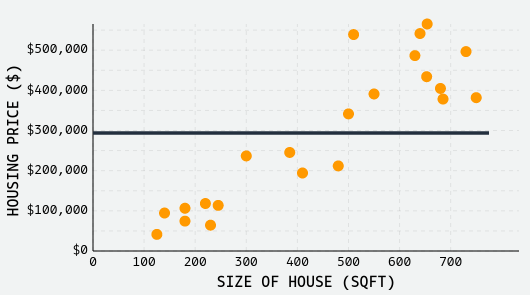
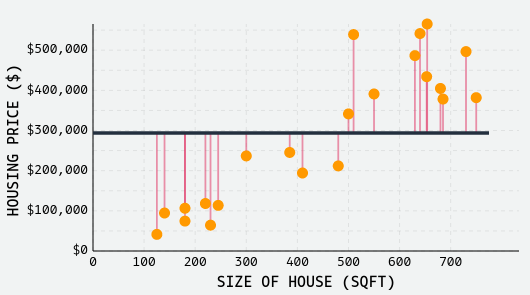
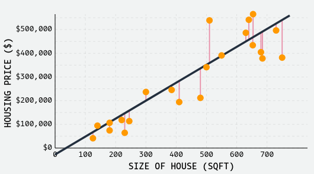

## How it works briefly

To make linear regression easier to digest, let's go through a quick, high-level introduction of how it works. We'll scroll through the core concepts of the algorithm at a high-level, and then delve into the details thereafter:

Let's fit a model to predict housing price ($) in San Diego, USA using the size of the house (in square-footage):

house-price= <b>β1​^</b> ∗ <b>sqft</b> + <b>β0</b>

We'll start with a very simple model, predicting the price of each house to be just the average house price in our dataset, **~$290,000**, ignoring the different sizes of each house:

house-price = **0 ∗ sqft + 290000**

Of course we know this model is bad - the model doesn't fit the data well at all. But how can do quantify exactly how bad?

To evaluate our model's performance quantitatively, we plot the error of each observation directly. These errors, or **residuals**, measure the distance between each observation and the predicted value for that observation. We'll make use of these residuals later when we talk about evaluating regression models, but we can clearly see that our model has a lot of error.

The goal of linear regression is reducing this error such that we find a line/surface that 'best' fits our data. For our simple regression problem, that involves estimating the y-intercept and slope of our model, <b>β0^</b>​ and <b>β1^</b>​.

For our specific problem, the best fit line is shown. There's still error, sure, but the general pattern is captured well. As a result, we can be reasonably confident that if we plug in new values of square-footage, our predicted values of price would be reasonably accurate.

Once we've fit our model, predicting future values is super easy! We just plug in any <b>xi</b>​ values into our equation!

For our simple model, that means plugging in a value for _sqft_ into our model:

_sqft_ Value: 407

<b>y^</b> ​ = **756.9 ∗ 407 − 27153.8**

<b>y^</b> = **280905**

Thus, our model predicts a house that is 407 square-feet will cost **$280,905**.

Now that we have a high-level idea of how linear regression works, let's dive a bit deeper. The remainder of this article will cover how to evaluate regression models, how to find the "best" model, how to interpret different forms of regression models, and the assumptions underpinning correct usage of regression models in statistical settings.

Let's dive in another day !!