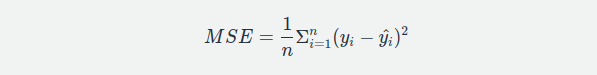
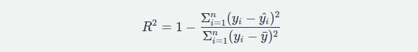
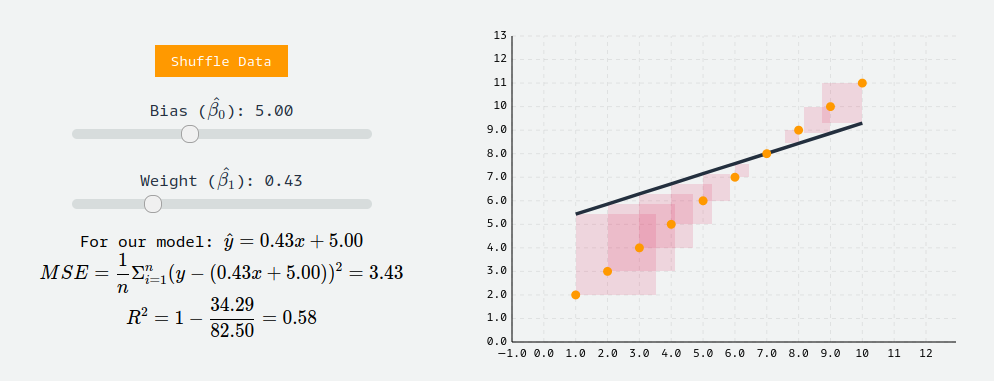

## Model Evaluation

To train an accurate linear regression model, we need a way to quantify how good (or bad) our model performs. In machine learning, we call such performance-measuring functions _loss functions_. Several popular loss functions exist for regression problems. To measure our model's performance, we'll use one of the most popular: mean-squared error (MSE). 

## Mean Squared Error

MSE quantifies how close a predicted value is to the true value, so we'll use it to quantify how close a regression line is to a set of points. MSE works by squaring the distance between each data point and the regression line (the red residuals in the graphs above), summing the squared values, and then dividing by the number of data points:

The name is quite literal: take the mean of the squared errors. The squaring of errors prevents negative and positive terms from canceling out in the sum, and gives more weight to points further from the regression line, punishing outliers. In practice, we'll fit our regression model to a set training data, and evaluate it's performance using MSE on the test dataset. 

## R-Squared

Regression models may also be evaluated with the so-called _goodness of fit_ measures, which summarize how well a model fits a set of data. The most popular goodness of fit measure for linear regression is r-squared, a metric that represents the percentage of the variance in _**y**_ explained by our features _**x**_. More specifically, r-squared measures the percentage of variance explained normalized against the baseline variance of our model (which is just the variance of the mean): 

The highest possible value for r-squared is 1, representing a model that captures 100% of the variance. A negative r-squared means that our model is doing worse (capturing less variance) than a flat line through mean of our data would.

To build intuition for yourself, try changing the weight and bias terms below to see how the MSE and r-squared change across different model fits by going through this [link](https://mlu-explain.github.io/linear-regression/)

You will often see R-Squared referenced in statistical contexts as a way to assess model fit. 

## Selecting an Evaluation Metric

Many methods exist for evaluating regression models, each with different concerns around interpretability, theory, and usability. The evaluation metric should reflect whatever it is you actually care about when making predictions. For example, when we use MSE, we are implicitly saying that we think the cost of our prediction error should reflect the quadratic (squared) distance between what we predicted and what is correct. This may work well if we want to punish outliers or if our data is minimized by the mean, but this comes at the cost of interpretability: we output our error in squared units (though this may be fixed with [RMSE](https://en.wikipedia.org/wiki/Root-mean-square_deviation)). If instead we wanted our error to reflect the linear distance between what we predicted and what is correct, or we wanted our data minimized by the median, we could try something like Mean Abosulte Error ([MAE](https://en.wikipedia.org/wiki/Mean_absolute_error)). Whatever the case, you should be thinking of your evaluation metric as part of your modeling process, and select the best metric based on the specific concerns of your use-case.

