## Learning the Coefficients

Let's recap what we've learned so far: Linear regression is all about finding a line (or surface) that fits our data well. And as we just saw, this involves selecting the coefficients for our model that minimize our evaluation metric. But how can we best estimate these coefficients? In practice, they're unknown, and selecting them by hand quickly becomes infeasible for regression models with many features. There must be a better way!

Luckily for us, several algorithms exist to do just this. We'll discuss two: an iterative solution and a closed-form solution. 

## An iterative solution

Gradient descent is an iterative optimization algorithm that estimates some set of coefficients to yield the minimum of a convex function. Put simply: it will find suitable coefficients for our regression model that minimize prediction error (remember, lower MSE equals better model).

## View the little math

Gradient descent works as follows. We assume that we have some convex function representing the error of our machine learning algorithm (in our case, MSE). Gradient descent will iteratively update our model's coefficients in the direction of our error functions minimum

In our case, our model takes the form:

<b>y^</b> ​= <b>β0​^</b> ​+ <b>β1​^​x</b>

and our error function takes the form:

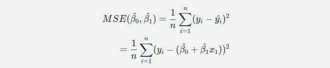

Our goal is to find the coefficients, <b>β0</b>​ and <b>β1</b>​, to minimize the error function. To do this, we'll use the gradient, which represents the direction that the function is increasing, and the rate at which it is increasing. Since we want to find the minimum of this function, we can go in the opposite direction of where it's increasing. This is exactly what Gradient Descent does, it works by taking steps in the direction opposite of where our error function is increasing, proportional to the rate of change. To find the coefficients that minimize the function, we first calculate the derivatives of our error function is increasing. To find the coefficients that minimize first, calculate the derivatives of our loss function, MSE: 

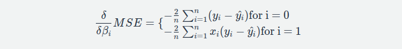

Now that we have the gradients for our error function (with respect to each coefficient to be updated), we perform iterative updates:

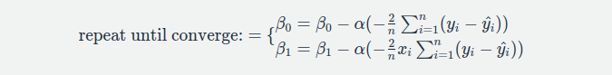

Updating these values iteratively will yield coefficients of our model that minimize error.

**Gradient descent** will iteratively identify the coefficients our model needs to fit the data. Let's see an example directly. We'll fit data to our equation <b>y^</b> = <b>β0^</b> + <b>β1^x1</b>​, so gradient descent will learn two coefficients, <b>β0</b> (the intercept) and <b>β1</b>​ (the weight). To do so, interact with the plot below. Try dragging the weights and values to create a 'poorly' fit (large error) solution and run gradient descent to see the error iteratively improve.

Tweak the parameters with some visualizations by going through the [link](https://mlu-explain.github.io/linear-regression/) like as below:

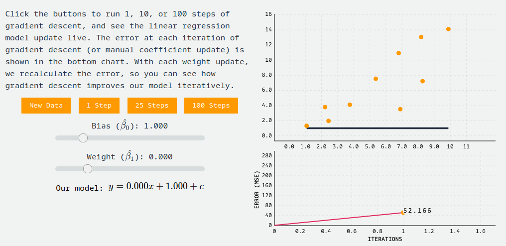

Although gradient descent is the most popular optimization algorithm in machine learning, it's not perfect! It doesn't work for every loss function, and it may not always find the most optimal set of coefficients for your model. Still, it has many extensions to help solve these issues, and is widely used across machine learning.

## A Closed Form Solution

We'd be remiss not to mention the Normal Equation, a widely taught method for obtaining estimates for our linear regression coefficients. The Normal Equation is a closed-form solution that allows us to estimate our coefficients directly by minimizing the residual sum of squares (RSS) of our data:

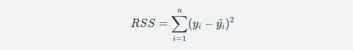

The RSS should look familiar - it was a key piece in both the MSE and r-squared formulas that represents our model's total squared error: 

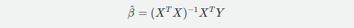

The RSS should look familiar - it was a key piece in both the MSE and r-squared formulas that represents our model's total squared error:

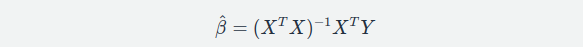

Despite providing a convenient closed-form solution for finding our optimal coefficients, the Normal Equation estimates are often not used in practice, because of the computational complexity required to invert a matrix with too many features. While our two feature example above runs fast (we can run it in the browser!), most machine learning models are more complicated. For this reason, we often just use gradient descent.

### Are our coefficients valid ?

In research publications and statistical software, coefficients of regression models are often presented with associated p-values. These p-values come from traditional null hypothesis statistical tests: t-tests are used to measure whether a given cofficient is significantly different than zero (the null hypothesis that a particular coefficient <b>βi</b>​ equals zero), while F tests are used to measure whether any of the terms in a regression model are significantly different from zero. Different opinions exist on the utility of such tests . We don't take a strong stance on this issue, but believe practitioners should always assess the standard error around any parameter estimates for themselves and present them in their research.

## Interpreting Regression models

One of the most powerful aspects of regression models is their interpretability. However, different forms of regression models require different interpretations. To make this clear, we'll walk through several typical constructs of a regression model, and describe how to interpret each in turn. For all aforementioned models, we interpret the error term as irreducible noise not captured by our model.

### A Binary Feature

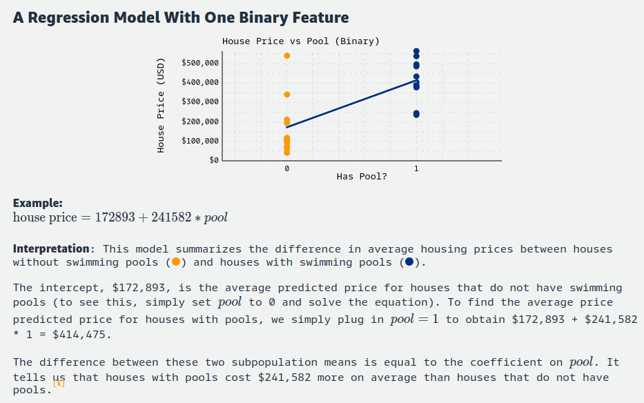

### A Continuous Feature

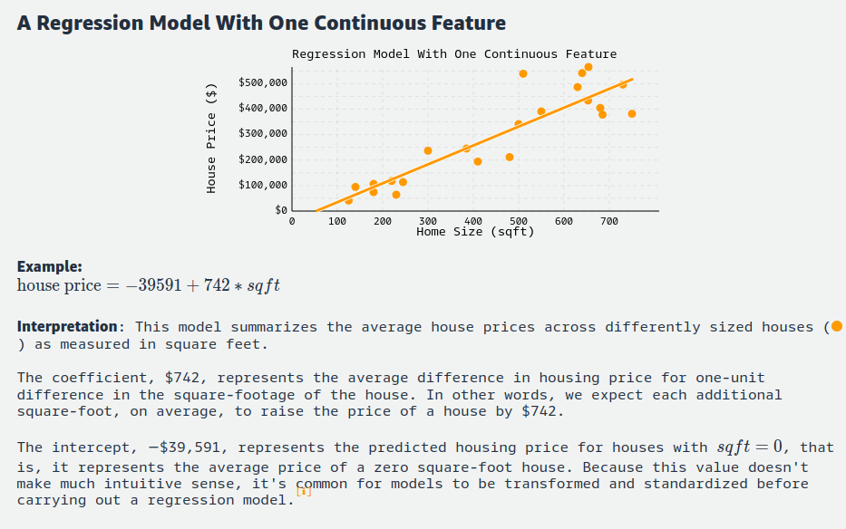

### Multivariate regression

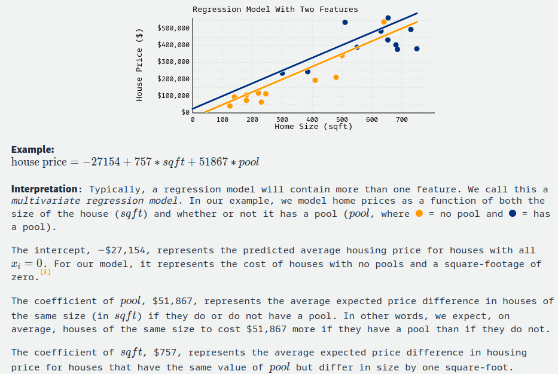

### Regression with Interaction

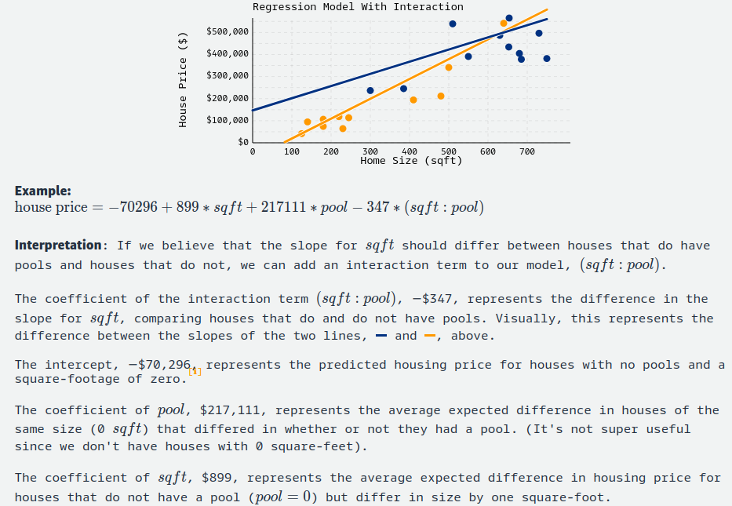

## Regression model assumptions

When teaching regression models, it's common to mention the various assumptions underpinning linear regression. For completion, we'll list some of those assumptions here. However, in the context of machine learning we care most about if the predictions made from our model generalize well to unseen data. We'll use our model if it generalizes well even if it violates statistical assumptions. Still, no treatment of regression is complete without mentioning the assumptions.

- **Validity:** Does the data we're modeling matches to the problem we're actually trying to solve?

- **Representativeness:** Is the sample data used to train the regression model representative of the population to which it will be applied?

- **Additivity and Linearity:** The deterministic component of a regression model is a linear function of the separate predictors: y= B0 + B1x1+...+ Bpxp.

- **Independence of Errors:** The errors from our model are independent.

- **Homoscedasticity:** The errors from our model have equal variance.
- **Normality of Errors:** The errors from our model are normally distributed.

### When Assumptions fail ?

What should we do if the assumptions for our regression model aren't met? Don't fret, it's not the end of the world! First, double-check that the assumptions even matter in the first place: if the predictions made from our model generalize well to unseen data, and our task is to create a model that generalizes well, then we're probably fine. If not, figure out which assumption is being violated, and how to address it! This will change depending on the assumption being violated, but in general, one can attempt to extend the model, accompany new data, transform the existing data, or some combination thereof. If a model transformation is unfit, perhaps the application (or research question) can be changed or restricted to better align with the data. In practice, some combination of the above will usually suffice.

