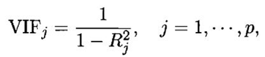

## Linear Regression Interview Questions

### Question 1

#### **What is linear regression?**

In simple terms, linear regression is a method of finding the best straight line fitting to the given data, i.e. finding the best linear relationship between the independent and dependent variables.

In technical terms, linear regression is a machine learning algorithm that finds the best linear-fit relationship on any given data, between independent and dependent variables. It is mostly done by the Sum of Squared Residuals Method.

To know more, click [here](http://www.datasciencelovers.com/machine-learning/linear-regression/)

### Question 2

#### **What are the important assumptions of Linear regression?**

Following are the assumptions

- **A linear Relationship** – Firstly, there has to be a linear relationship between the dependent and the independent variables. To check this relationship, a scatter plot proves to be useful.
- **Restricted Multi-collinearity value** – Secondly, there must no or very little multi-collinearity between the independent variables in the dataset. The value needs to be restricted, which depends on the domain requirement.
- **Homoscedasticity** – The third is the homoscedasticity. It is one of the most important assumptions which states that the errors are equally distributed. 

### Question 3

#### **What is heteroscedasticity?**

Heteroscedasticity is exactly the opposite of homoscedasticity, which means that the error terms are not equally distributed. To correct this phenomenon, usually, a log function is used.

### Question 4

#### **What is the difference between R square and adjusted R square?**

R square and adjusted R square values are used for model validation in case of linear regression. R square indicates the variation of all the independent variables on the dependent variable. I.e. it considers all the independent variable to explain the variation. In the case of Adjusted R squared, it considers only significant variables (P values less than 0.05) to indicate the percentage of variation in the model. To know more, click [here](http://www.datasciencelovers.com/blog/statistics-interview-questions-and-answers-for-data-scientist/)

### Question 5

#### **Can we use linear regression for time series analysis?**

One can use linear regression for time series analysis, but the results are not promising. So, it is generally not advisable to do so. The reasons behind this are.

1. Time series data is mostly used for the prediction of the future, but linear regression seldom gives good results for future prediction as it is not meant for extrapolation.
2. Mostly, time series data have a pattern, such as during peak hours, festive seasons, etc., which would most likely be treated as outliers in the linear regression analysis

### Question 6

#### **What is VIF? How do you calculate it?**

Variance Inflation Factor (VIF) is used to check the presence of multicollinearity in a data set. It is calculated as

Here, VIFj  is the value of VIF for the jth variable, Rj2 is the R2 value of the model when that variable is regressed against all the other independent variables.

If the value of VIF is high for a variable, it implies that the R2  value of the corresponding model is high, i.e. other independent variables are able to explain that variable. In simple terms, the variable is linearly dependent on some other variables.

### Question 7

#### **How to find RMSE and MSE?**

RMSE and MSE are the two of the most common measures of accuracy for a linear regression.

RMSE indicates the Root mean square error, which indicated by the formula:

Where MSE indicates the Mean square error represented by the formula:

### Question 8

#### **How to interpret a Q-Q plot in a Linear regression model?**

A Q-Q plot is used to check the normality of errors. In the above chart mentioned, Majority of the data follows a normal distribution with tails curled. This shows that the errors are mostly normally distributed but some observations may be due to significantly higher/lower values are affecting the normality of errors.

### Question 9

#### **What is the significance of an F-test in a linear model?**

The use of F-test is to test the goodness of the model. When the model is re-iterated to improve the accuracy with changes, the F-test values prove to be useful in terms of understanding the effect of overall regression.

### Question 10

#### **What are the disadvantages of the linear model?**

Linear regression is sensitive to outliers which may affect the result.

– **Over-fitting**

– **Under-fitting**

### Question 11

#### **You run your regression on different subsets of your data, and in each subset, the beta value for a certain variable varies wildly. What could be the issue here?**

This case implies that the dataset is heterogeneous. So, to overcome this problem, the dataset should be clustered into different subsets, and then separate models should be built for each cluster. Another way to deal with this problem is to use non-parametric models, such as decision trees, which can deal with heterogeneous data quite efficiently.

### Question 12

#### **Which graphs are suggested to be observed before model fitting?**

Before fitting the model, one must be well aware of the data, such as what the trends, distribution, skewness, etc. in the variables are. Graphs such as histograms, box plots, and dot plots can be used to observe the distribution of the variables. Apart from this, one must also analyse what the relationship between dependent and independent variables is. This can be done by scatter plots (in case of univariate problems), rotating plots, dynamic plots, etc .

### Question 13

#### **Explain the bias-variance trade-off.**

Bias refers to the difference between the values predicted by the model and the real values. It is an error. One of the goals of an ML algorithm is to have a low bias.
Variance refers to the sensitivity of the model to small fluctuations in the training dataset. Another goal of an ML algorithm is to have low variance.
For a dataset that is not exactly linear, it is not possible to have both bias and variance low at the same time. A straight line model will have low variance but high bias, whereas a high-degree polynomial will have low bias but high variance.

There is no escaping the relationship between bias and variance in machine learning.

- Decreasing the bias increases the variance.
- Decreasing the variance increases the bias.

So, there is a trade-off between the two; the ML specialist has to decide, based on the assigned problem, how much bias and variance can be tolerated. Based on this, the final model is built.

### Question 14

#### **What is MAE and RMSE and what is the difference between the matrices?**

**Mean Absolute Error (MAE):** MAE measures the average magnitude of the errors in a set of predictions, without considering their direction. It’s the average over the test sample of the absolute differences between prediction and actual observation where all individual differences have equal weight.

**Root mean squared error (RMSE):** RMSE is a quadratic scoring rule that also measures the average magnitude of the error. It’s the square root of the average of squared differences between prediction and actual observation.

**Difference :**

- Taking the square root of the average squared errors has some interesting implications for RMSE. Since the errors are squared before they are averaged, the RMSE gives a relatively high weight to large errors. This means the RMSE should be more useful when large errors are particularly undesirable.

- From an interpretation standpoint, MAE is clearly the winner. RMSE does not describe average error alone and has other implications that are more difficult to tease out and understand.

- On the other hand, one distinct advantage of RMSE over MAE is that RMSE avoids the use of taking the absolute value, which is undesirable in many mathematical calculations.

