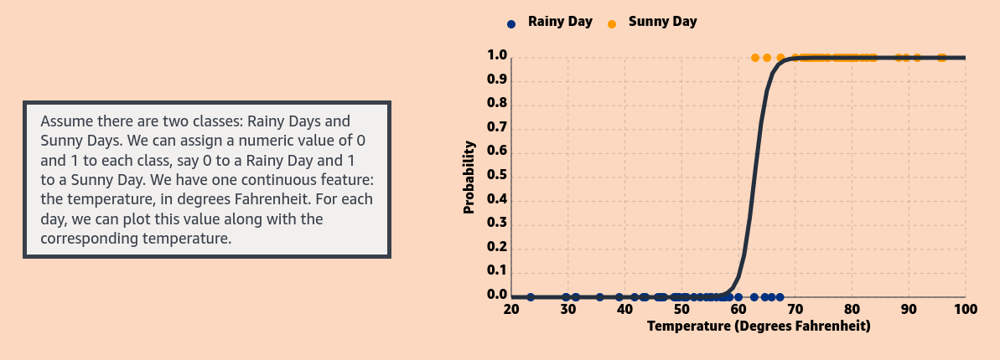
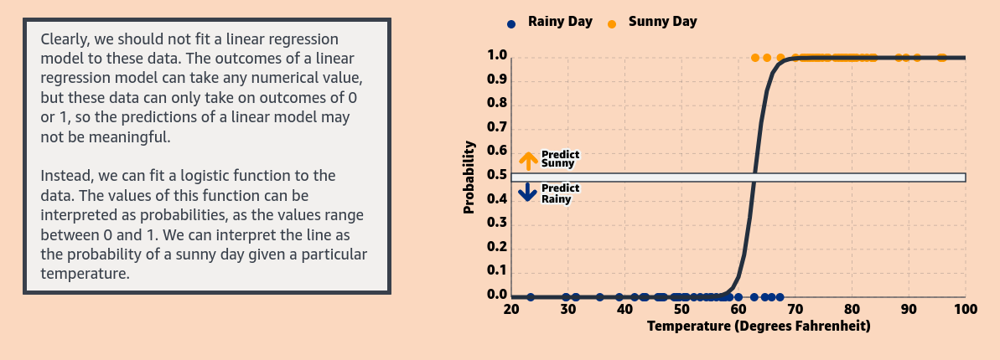
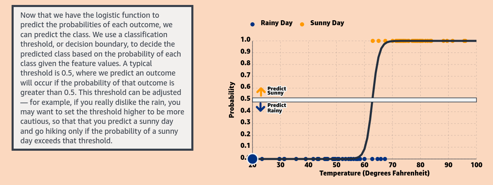
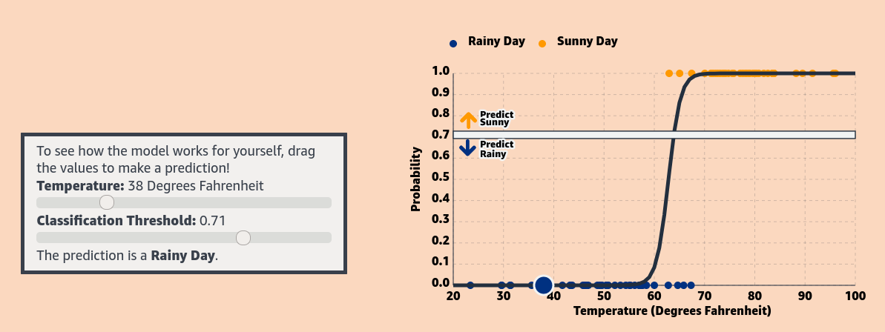

## What is Logistic Regression ?

One major area in machine learning is supervised learning, where the goal is to predict an output given some inputs. The output value may be a numerical or categorical variable. In this article, we will discuss logistic regression: a supervised learning algorithm that can be used to classify data into categories, or classes, by predicting the probability that an observation falls into a particular class based on its features.

Though it can be extended to more than two categories, logistic regression is often used for binary classification, i.e. determining which of two groups a data point belongs to, or whether an event will occur or not. In this article, we will focus on binary logistic regression.

The typical setup for logistic regression is as follows: there is an outcome yy that falls into one of two categories (say 0 or 1), and the following equation is used to estimate the probability that _**y**_ belongs to a particular category given inputs X=(x1,x2,...,xk): 

P(_y_ = 1 ∣ X) = sigmoid(_z_) = 1/1 + e−z

If you have ever encountered linear regression, the equation for _z_ likely looks familiar. This is called a linear predictor, and it is transformed by the sigmoid function so that the values fall between 0 and 1, and can therefore be interpreted as probabilities. This resulting probability is then compared to a threshold to predict a class for _y_ based on _X_.​​

## How it Works ?

Let’s make this a bit more concrete by walking through an example. Suppose that you want to go for a hike in Seattle. You want to predict whether it will be sunny or rainy, so that you can decide whether to hike or drink coffee indoors at a local cafe. You know that it rains often in Seattle, but you’ve heard the summers have nice weather. The question is: can we predict the weather, given factors such as the temperature?

Now to visualize , how the threshold affects the sigmoid function, click [here](https://www.mlu-explain.github.io/logistic-regression/)

