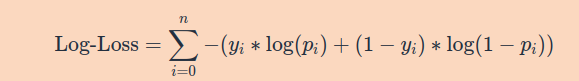
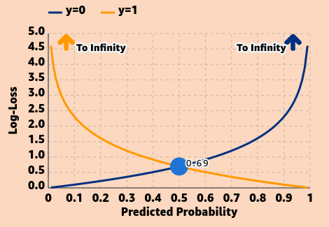

## Evaluating Our Model

When fitting our model, the goal is to find the parameters that optimize a function that defines how well the model is performing. Put simply, the goal is to make predictions as close to 1 when the outcome is 1 and as close to 0 when the outcome is 0. In machine learning, the function to be optimized is called the loss function or cost function. We use the loss function to determine how well our model fits the data.

A suitable loss function in logistic regression is called the Log-Loss, or binary cross-entropy. This function is: 

where nn is the number of samples, indexed by ii, yiyi​ is the true class for the index ii, and pipi​ is the model prediction for the index ii. Minimizing the Log-Loss is equivalent to maximizing the Log-Likelihood, since the Log-Loss is the negative of the Log-Likelihood.

This graph shows how the Log-Loss depends on the true value for yy and the predicted probability. You can see how as the probability gets closer to the true value (_p_ = 0 when _y=0_ and _p=1_ when _y=1_), the Log-Loss decreases to 0. As the probability gets further from the true value, the Log-Loss approaches infinity.

Here, **true value of y = 0** and **probability is 0.5**

You can visualize more value by going [here .](https://mlu-explain.github.io/logistic-regression/)

