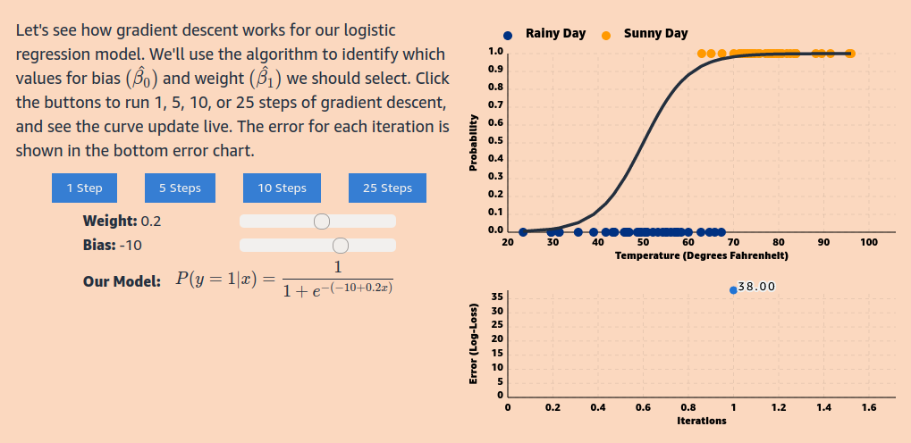
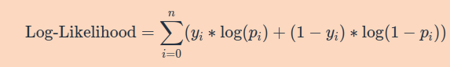

## Estimating Coefficients

How do we find the coefficients (β0^,β1^,...,βk^​) that minimize the loss function? There are two main approaches for logistic regression: gradient descent and maximum likelihood estimation. We’ll briefly discuss both here.

## Gradient Descent

A common way to estimate coefficients is to use gradient descent. In gradient descent, the goal is to minimize the Log-Loss cost function over all samples. This method involves selecting initial parameter values, and then updating them incrementally by moving them in the direction that decreases the loss. At each iteration, the parameter value is updated by the gradient, scaled by the step size (otherwise known as the learning rate). The gradient is the vector encompassing the direction and rate of the fastest increase of a function, which can be calculated using partial derivatives. The parameters are updated in the opposite direction of the gradient by the step size in an attempt to find the parameter values that minimize the Log-Loss.

Because the gradient calculates where the function is increasing, going in the opposite direction leads us to the minimum of our function. In this manner, we can repeatedly update our model's coefficients such that we eventually reach the minimum of our error function and obtain a sigmoid curve that fits our data well.

## Maximum Likelihood Estimation

Another approach is finding the model that maximizes the likelihood of observing the data by using Maximum Likelihood Estimation (MLE). It turns out, minimizing the Log-Loss is equivalent to maximizing the Log-Likelihood. Therefore, the goal is to find the parameter values that maximize the following: 

We can do so by differentiating the Log-Likelihood with respect to the parameters, setting the derivatives equal to 0, and solving the equation to find the estimates of the parameters.

