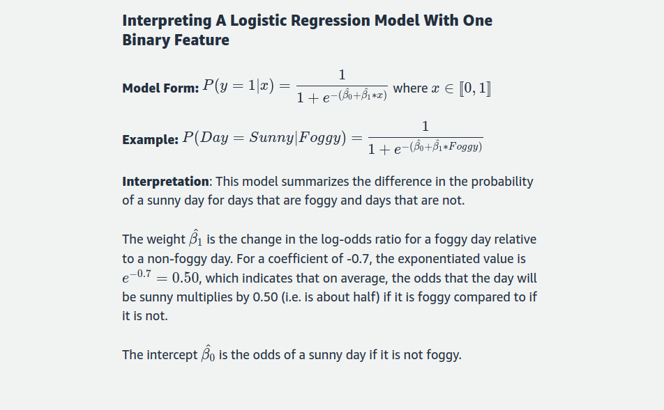
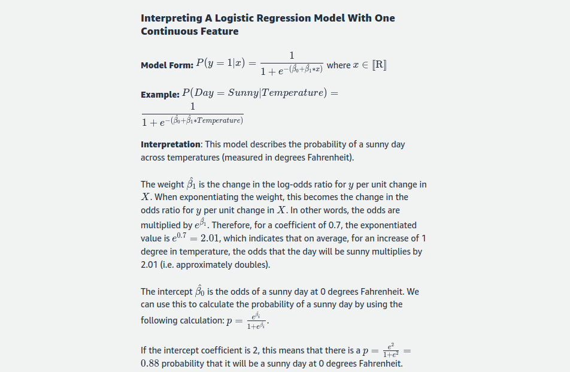
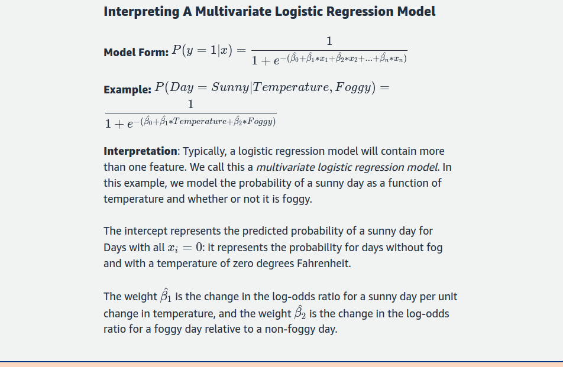

## Interpreting Logistic Regression Models

Interpreting the coefficients of a logistic regression model can be tricky because the coefficients in a logistic regression are on the log-odds scale. This means the interpretations are different than in linear regression.

To understand log-odds, we must first understand odds. Odds are calculated as _p/1-p_. This gives the ratio of the probability of a sunny day to that of a rainy day. Say that the probability of a sunny day is 0.75. This implies that the probability of a rainy day is 0.25. The odds would then be 
_0.75/0.25_ = 3 which means that the odds of a sunny day are 3 to 1. If the probability of rain is 0.5, then the odds would be 
_0.5/0.5_ = 1, meaning that the odds of a sunny day are 1 to 1, so sun and rain are equally likely. Taking the log of the odds yields the log-odds, and taking ratios of log-odds yields log-odds ratios.

Now that we understand log-odds a bit more, we can discuss how to interpret the models. Since the coefficients are on the log-odds scale, we can transform them to the odds scale by exponentiating so that they are easier to interpret.

### A Binary Feature

### A Continuous Feature

### A Multivariate Feature

