## Frame the problem 🖼️

Let's start with a example dataset and analyze , extract all the insights that what that data is speaking to us. Hence we are going to get the dataset from **kaggle** and perform **exploratory data analysis**.

## About Data 🗄️

We are using **cars4u** dataset which you can access it from [here](https://www.kaggle.com/datasets/sukhmanibedi/cars4u). This dataset is in **xls** format. Dataset contains many features such as `Name`, `Location`, `Year`, `Kilometers_Driven`, `Fuel_Type`, `Transmission`....... and one **target** column is `price` of car.

## Import the essentials

```python
import pandas as pd
import numpy as np
import matplotlib.pyplot as plt
import seaborn as sns
#to ignore warnings
import warnings
warnings.filterwarnings('ignore')
```

## View the data 👁️‍🗨️

We can view the sample data using below code -

```python
data.head()
```
**Output**


## Info and describe 🤡

As we can see, data contains numerical features as well as categorical features, let's view it and also understand `max` , `min`, `count`, `mean` etc of all the features for statistical analysis.

```python
data.info()
```
**Output**


```python
data.describe().T
```

**Output**


**Note** - Describe function analyzes the statistical insights of only numerical features.

From the statistics summary, we can infer the below findings :

- Years range from 1996- 2019 and has a high in a range which shows used cars contain both latest models and old model cars.
- On average of Kilometers-driven in Used cars are ~58k KM. The range shows a huge difference between min and max as max values show 650000 KM shows the evidence of an outlier. This record can be removed.
- Min value of Mileage shows 0 cars won’t be sold with 0 mileage. This sounds like a data entry issue.
- It looks like Engine and Power have outliers, and the data is right-skewed.
- The average number of seats in a car is 5. car seat is an important feature in price contribution.
- The max price of a used car is 160k which is quite weird, such a high price for used cars. There may be an outlier or data entry issue.


## Number of Unique values 

Why we need to find unique values ? 
- because when length of data is not equal to total unique value, it means data contains duplicate values and duplicate values is the senseless thing in the data.

```python
data.nunique()
```
**Output**


## Missing values calculation 🖩

Our machine learning model doesn't work wells when there is missing values in the data. Sometimes it also gives errors that data has `NaN` values. So to count number of missing values. we can use 

```python
data.isnull().sum() # it will display number of missing values in each feature
```

**Output**


We can see that there are missing values in feature `engine`, `power`, `seats`, `new price` and `price`. In further days, we'll deal with those missing values that how we can remove them or replace them.

## Remove Unwanted columns 📎

There are many columns which we don't want to use for training our machine learning model, like `S.No` because this column don't have a meaning it is just numbering. So we'll remove them 

```python
data = data.drop(['S.No.'],axis=1) # axis = 1 is for column wise
```

**After removing column, dataset will look like**


## Feature Engineering 🏎️

Feature engineering refers to the process of using domain knowledge to select and transform the most relevant variables from raw data when creating a predictive model using machine learning or statistical modeling. The main goal of Feature engineering is to create meaningful data from raw data. 

### Creating features 🏗️

It would be difficult to find the car’s age if it is in year format as the Age of the car is a contributing factor to Car Price. 

Let's introduce a new column `car_age` for calculating age of car.

```python
from datetime import date
date.today().year
data['Car_Age']=date.today().year-data['Year']
data.head()
```

**Output**


Since car names will not be great predictors of the price in our current data. But we can process this column to extract important information using brand and Model names. Let’s split the name and introduce new variables **Brand** and **Model**

```python
data['Brand'] = data.Name.str.split().str.get(0)
data['Model'] = data.Name.str.split().str.get(1) + data.Name.str.split().str.get(2)
data[['Name','Brand','Model']]
```

**After splitting the `brand`, `name` and `model`, columns will look like**


## Let's clean the data 🪥

Some names of the variables are not relevant and not easy to understand. Some data may have data entry errors, and some variables may need data type conversion. We need to fix this issue in the data.

`In the example`, The brand name ‘Isuzu’ ‘ISUZU’ and ‘Mini’ and ‘Land’ looks incorrect. This needs to be corrected

As you can see below 👇


So 

```python
searchfor = ['Isuzu' ,'ISUZU','Mini','Land']
data[data.Brand.str.contains('|'.join(searchfor))].head(5) ## run this cell

# hence we'll replace the word and will correct it

data["Brand"].replace({"ISUZU": "Isuzu", "Mini": "Mini Cooper","Land":"Land Rover"}, inplace=True)
```

## Separate something 🇾 🇾

Before moving further to **univariate** and *bivariate* analysis, let's separate **numerical** and **categorical** features.

```python
cat_cols=data.select_dtypes(include=['object']).columns
num_cols = data.select_dtypes(include=np.number).columns.tolist()

```

## Univariate Analysis 🪐

Now **Univariate** analysis means analyzing every feature of the dataset so that we'll get clarity regarding preprocessing things for each features. We'll create some distribution charts like

- **Skew value** to understand that is our distribution of numerical feature is normal (bell curve) or not (biased left or right).
- **Histogram** is a graph plot to define the distribution of each feature (we can also use kernle plot).
- **Box plot** to understand that feature contains outliers or not.

```python
for col in num_cols:
    print(col)
    print('Skew :', round(data[col].skew(), 2))
    plt.figure(figsize = (15, 4))
    plt.subplot(1, 2, 1)
    data[col].hist(grid=False)
    plt.ylabel('count')
    plt.subplot(1, 2, 2)
    sns.boxplot(x=data[col])
    plt.show()
```

**Output**


`Price` and `Kilometers Driven` are right skewed for this data to be transformed, and all outliers will be handled during imputation

**Categorical variables** are being visualized using a count plot. Categorical variables provide the pattern of factors influencing car price.

```python
fig, axes = plt.subplots(3, 2, figsize = (18, 18))
fig.suptitle('Bar plot for all categorical variables in the dataset')
sns.countplot(ax = axes[0, 0], x = 'Fuel_Type', data = data, color = 'blue', 
              order = data['Fuel_Type'].value_counts().index);
sns.countplot(ax = axes[0, 1], x = 'Transmission', data = data, color = 'blue', 
              order = data['Transmission'].value_counts().index);
sns.countplot(ax = axes[1, 0], x = 'Owner_Type', data = data, color = 'blue', 
              order = data['Owner_Type'].value_counts().index);
sns.countplot(ax = axes[1, 1], x = 'Location', data = data, color = 'blue', 
              order = data['Location'].value_counts().index);
sns.countplot(ax = axes[2, 0], x = 'Brand', data = data, color = 'blue', 
              order = data['Brand'].head(20).value_counts().index);
sns.countplot(ax = axes[2, 1], x = 'Model', data = data, color = 'blue', 
              order = data['Model'].head(20).value_counts().index);
axes[1][1].tick_params(labelrotation=45);
axes[2][0].tick_params(labelrotation=90);
axes[2][1].tick_params(labelrotation=90);
```

**Output**

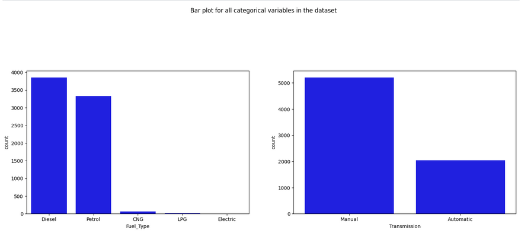

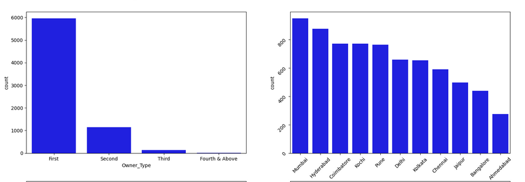

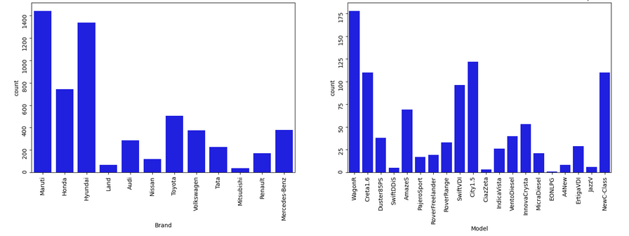

From the count plot, we can have below observations

- Mumbai has the highest number of cars available for purchase, followed by Hyderabad and Coimbatore
- 53% of cars have fuel type as Diesel this shows diesel cars provide higher performance
- 72% of cars have manual transmission
- 82 % of cars are First owned cars. This shows most of the buyers prefer to purchase first-owner cars
- 20% of cars belong to the brand Maruti followed by 19% of cars belonging to Hyundai
- WagonR ranks first among all models which are available for purchase

## Data Transformation ⛑️

Before we proceed to Bi-variate Analysis, Univariate analysis demonstrated the data pattern as some variables to be transformed.

Price and Kilometer-Driven variables are highly skewed and on a larger scale. Let’s do log transformation.

Log transformation can help in normalization, so this variable can maintain standard scale with other variables:

```python
# Function for log transformation of the column
def log_transform(data,col):
    for colname in col:
        if (data[colname] == 1.0).all():
            data[colname + '_log'] = np.log(data[colname]+1)
        else:
            data[colname + '_log'] = np.log(data[colname])
    data.info()
log_transform(data,['Kilometers_Driven','Price'])

#Log transformation of the feature 'Kilometers_Driven'
sns.distplot(data["Kilometers_Driven_log"], axlabel="Kilometers_Driven_log")
```

**Output**

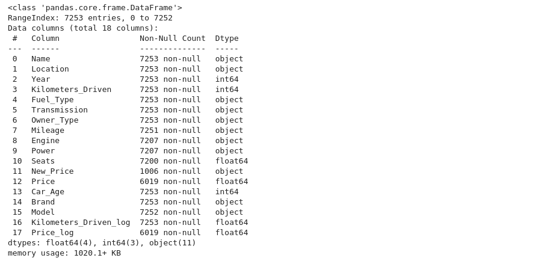

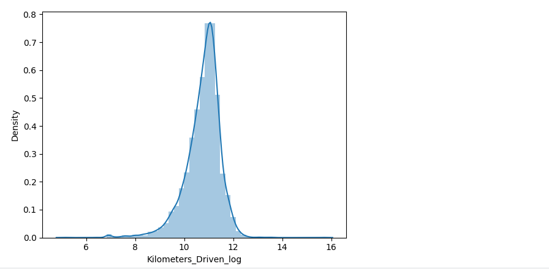

## Bivariate Analysis ✌️

Now, let’s move ahead with bivariate analysis. Bivariate Analysis helps to understand how variables are related to each other and the relationship between dependent and independent variables present in the dataset.

For Numerical variables, Pair plots and Scatter plots are widely been used to do Bivariate Analysis.

A Stacked bar chart can be used for categorical variables if the output variable is a classifier. Bar plots can be used if the output variable is continuous

In our example, a pair plot has been used to show the relationship between two Categorical variables.

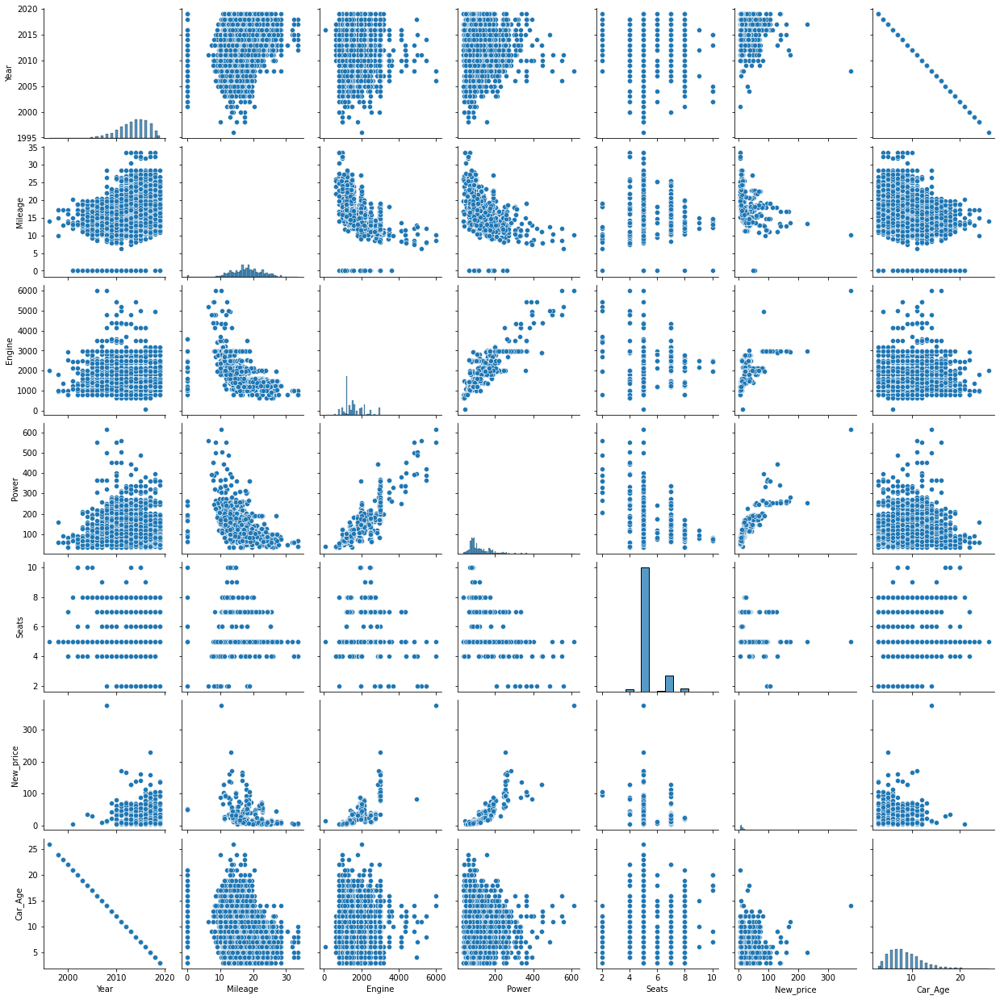

Pair Plot provides below insights:

- The variable Year has a positive correlation with price and mileage
- A year has a Negative correlation with kilometers-Driven
- Mileage is negatively correlated with Power
- As power increases, mileage decreases
- Car with recent make is higher at prices. As the age of the car increases price decreases
- Engine and Power increase, and the price of the car increases

**A bar plot can be used to show the relationship between Categorical variables and continuous variables.**

```python
fig, axarr = plt.subplots(4, 2, figsize=(12, 18))
data.groupby('Location')['Price_log'].mean().sort_values(ascending=False).plot.bar(ax=axarr[0][0], fontsize=12)
axarr[0][0].set_title("Location Vs Price", fontsize=18)
data.groupby('Transmission')['Price_log'].mean().sort_values(ascending=False).plot.bar(ax=axarr[0][1], fontsize=12)
axarr[0][1].set_title("Transmission Vs Price", fontsize=18)
data.groupby('Fuel_Type')['Price_log'].mean().sort_values(ascending=False).plot.bar(ax=axarr[1][0], fontsize=12)
axarr[1][0].set_title("Fuel_Type Vs Price", fontsize=18)
data.groupby('Owner_Type')['Price_log'].mean().sort_values(ascending=False).plot.bar(ax=axarr[1][1], fontsize=12)
axarr[1][1].set_title("Owner_Type Vs Price", fontsize=18)
data.groupby('Brand')['Price_log'].mean().sort_values(ascending=False).head(10).plot.bar(ax=axarr[2][0], fontsize=12)
axarr[2][0].set_title("Brand Vs Price", fontsize=18)
data.groupby('Model')['Price_log'].mean().sort_values(ascending=False).head(10).plot.bar(ax=axarr[2][1], fontsize=12)
axarr[2][1].set_title("Model Vs Price", fontsize=18)
data.groupby('Seats')['Price_log'].mean().sort_values(ascending=False).plot.bar(ax=axarr[3][0], fontsize=12)
axarr[3][0].set_title("Seats Vs Price", fontsize=18)
data.groupby('Car_Age')['Price_log'].mean().sort_values(ascending=False).plot.bar(ax=axarr[3][1], fontsize=12)
axarr[3][1].set_title("Car_Age Vs Price", fontsize=18)
plt.subplots_adjust(hspace=1.0)
plt.subplots_adjust(wspace=.5)
sns.despine()
```
**Output**

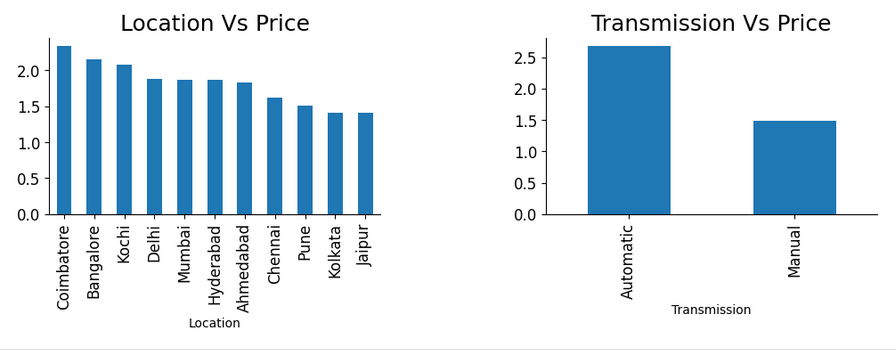

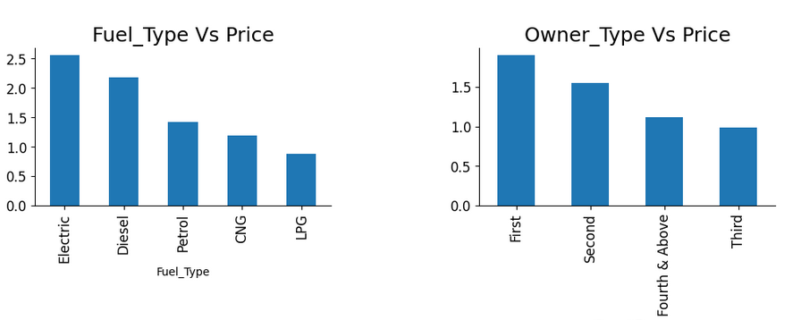

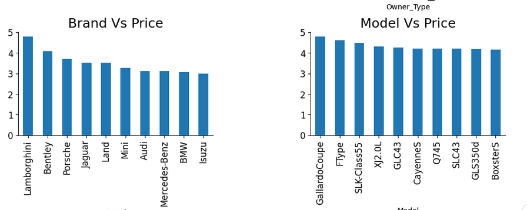

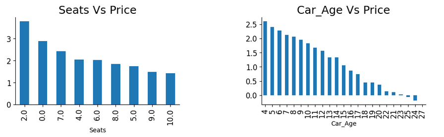

- Observations

    - The price of cars is high in Coimbatore and less price in Kolkata and Jaipur
    - Automatic cars have more price than manual cars.
    - Diesel and Electric cars have almost the same price, which is maximum, and LPG cars have the lowest price
    - First-owner cars are higher in price, followed by a second
    - The third owner’s price is lesser than the Fourth and above
    - Lamborghini brand is the highest in price
    - Gallardocoupe Model is the highest in price
    - 2 Seater has the highest price followed by 7 Seater
    - The latest model cars are high in price

## Multivariate Analysis 🚄

As the name suggests, Multivariate analysis looks at more than two variables. Multivariate analysis is one of the most useful methods to determine relationships and analyze patterns for any dataset.

A heat map is widely been used for Multivariate Analysis

Heat Map gives the correlation between the variables, whether it has a positive or negative correlation.

In our example heat map shows the correlation between the variables.

```python
plt.figure(figsize=(12, 7))
sns.heatmap(data.drop(['Name','Location','Transmission','Owner_Type','Mileage','Engine','Power','Brand','New_Price','Model','Fuel_Type','Kilometers_Driven','Price'],axis=1).corr(), annot = True, vmin = -1, vmax = 1)
plt.show()
```

**Output**

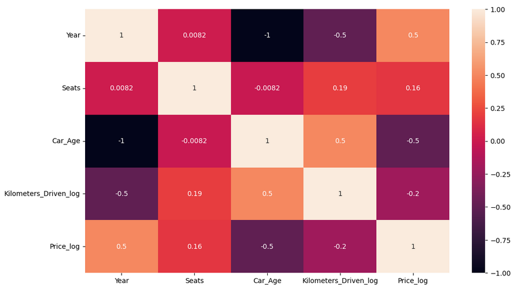


## Finished  🎊🎊

We've reached to end of **EDA**. To be honest, there are lots of things and different exploration regarding different dataset and usecases. As we learn gradually, we'll learn differen techniques


