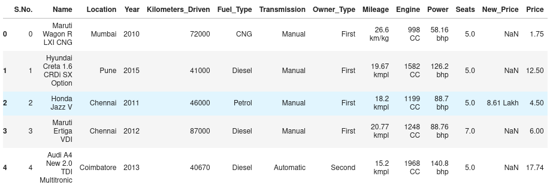
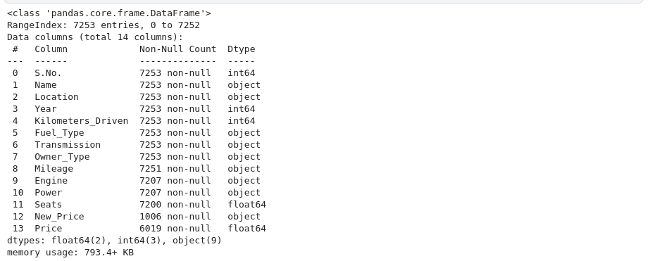
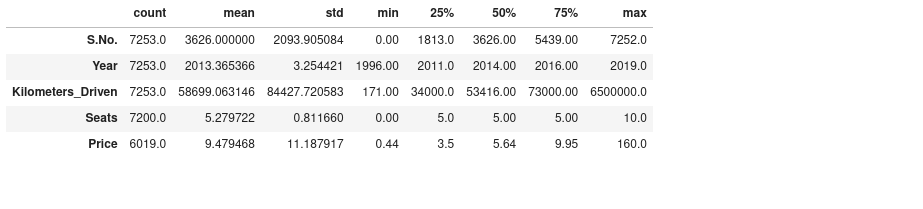
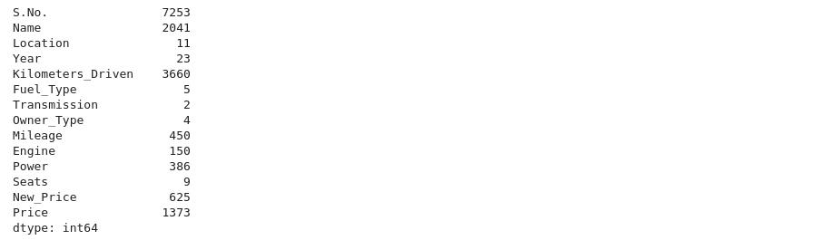
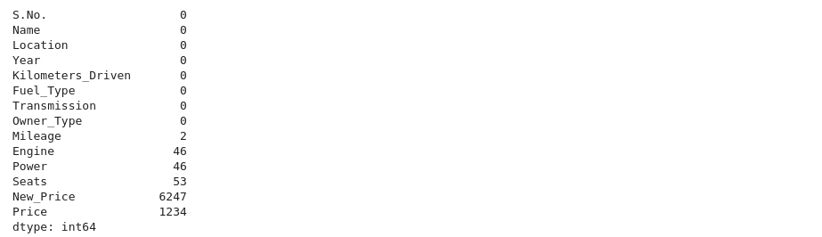
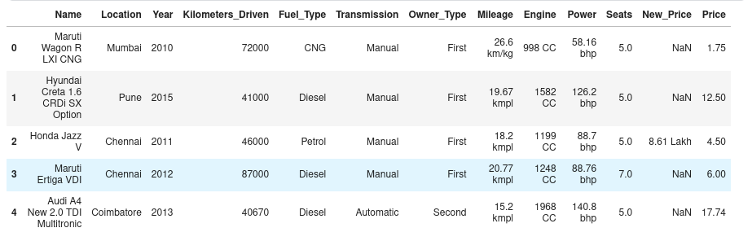

## Frame the problem 🖼️

Let's start with a example dataset and analyze , extract all the insights that what that data is speaking to us. Hence we are going to get the dataset from **kaggle** and perform **exploratory data analysis**.

## About Data 🗄️

We are using **cars4u** dataset which you can access it from [here](https://www.kaggle.com/datasets/sukhmanibedi/cars4u). This dataset is in **xls** format. Dataset contains many features such as `Name`, `Location`, `Year`, `Kilometers_Driven`, `Fuel_Type`, `Transmission`....... and one **target** column is `price` of car.

## View the data 👁️‍🗨️

We can view the sample data using below code -

```python
data.head()
```
**Output**



## Info and describe 🤡

As we can see, data contains numerical features as well as categorical features, let's view it and also understand `max` , `min`, `count`, `mean` etc of all the features for statistical analysis.

```python
data.info()
```
**Output**



```python
data.describe().T
```

**Output**



**Note** - Describe function analyzes the statistical insights of only numerical features.

## Number of Unique values 

Why we need to find unique values ? 
- because when length of data is not equal to total unique value, it means data contains duplicate values and duplicate values is the senseless thing in the data.

```python
data.nunique()
```
**Output**



## Missing values calculation 🖩

Our machine learning model doesn't work wells when there is missing values in the data. Sometimes it also gives errors that data has `NaN` values. So to count number of missing values. we can use 

```python
data.isnull().sum() # it will display number of missing values in each feature
```

**Output**



We can see that there are missing values in feature `engine`, `power`, `seats`, `new price` and `price`. In further days, we'll deal with those missing values that how we can remove them or replace them.

## Remove Unwanted columns 📎

There are many columns which we don't want to use for training our machine learning model, like `S.No` because this column don't have a meaning it is just numbering. So we'll remove them 

```python
data = data.drop(['S.No.'],axis=1) # axis = 1 is for column wise
```

**After removing column, dataset will look like**



