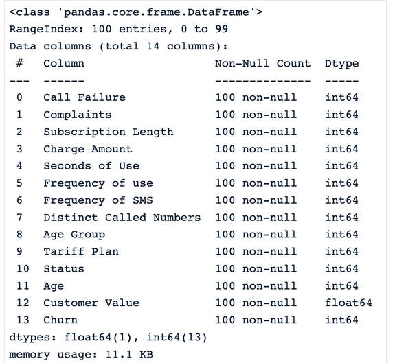
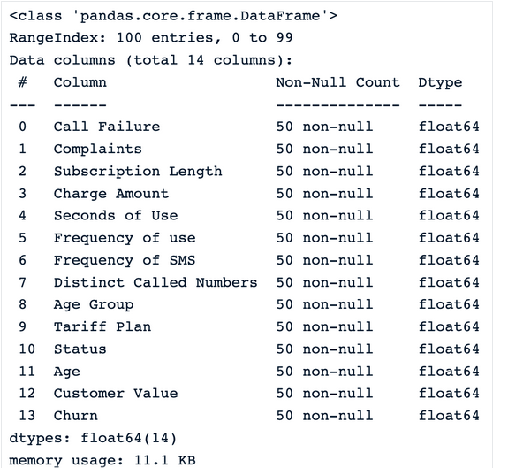
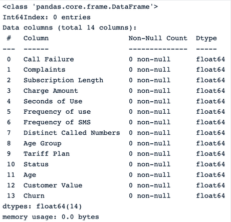
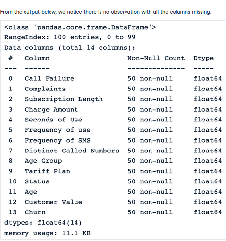
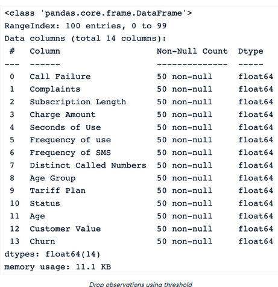
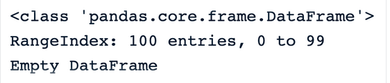
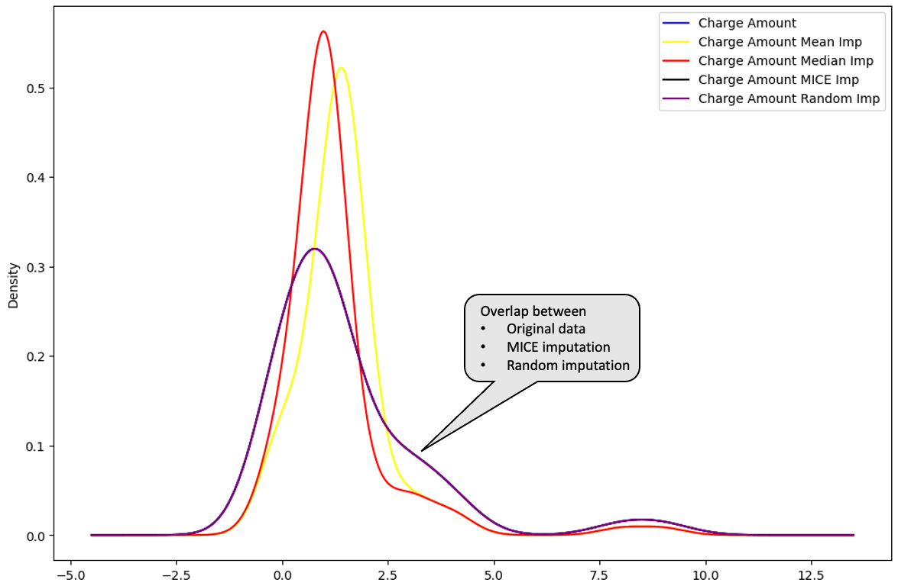

## Different Techniques to impute ⛈️ ⛈️

As we know, missing data in a dataset is a big **NO** ❌❌ Because of the following reasons - 

- It leads to poor performance of any **Machine Learning models** 👎
- Distribution of the features become distorted 🪅

Dealing with missing data is a common and inherent issue in data collection, especially when working with large datasets. There are various reasons for missing data, such as incomplete information provided by participants, non-response from those who decline to share information, poorly designed surveys, or removal of data for confidentiality reasons.

When not appropriately handled, missing data can bias the conclusions of all the statistical analyses on the data, leading the business to make wrong decisions.

### Types of missing data 🆎

Missing data occurs in different formats. This section explains the different types of missing data and how to identify them.

#### MCAR - Missing completely at random 🌑

This happens if all the variables and observations have the same probability of being missing. Imagine providing a child with Lego of different colors to build a house. Each Lego represents a piece of information, like shape and color. The child might lose some Legos during the game. These lost legos represent missing information, just like when they can’t remember the shape or the color of the Lego they had. That information was lost randomly, but they do not change the information the child has on the other Legos. `Inshort , data that we've lost or missing is not harming or related to any other feature.`

#### MAR - Missing at random 🌙

For MAR, the probability of the value being missing is related to the value of the variable or other variables in the dataset. This means that not all the observations and variables have the same chance of being missing. An example of MAR is a survey in the Data community where data scientists who do not frequently upgrade their skills are more likely not to be aware of new state-of-the-art algorithms or technologies, hence skipping certain questions. The missing data, in this case, is related to how frequently the data scientist upskills. `Like here, if we are not updating our knowledge, we'll go to downfall or become jobless means missing value is related (partially) somewhere.`

#### MNAR- Missing not at random ☀️

MNAR is considered to be the most difficult scenario among the three types of missing data. It is applied when neither MAR nor MCAR apply. In this situation, the probability of being missing is completely different for different values of the same variable, and these reasons can be unknown to us. An example of MNAR is a survey about married couples. Couples with a bad relationship might not want to answer certain questions as they might feel embarrassed to do so. `We can't find out, why values are missing or any relation.`

## How to identify missing value 👓

Basically we used these function to find out any missing data in a features :- 

|Functions|Descriptions|
|---------|------------|
|**.isnull()**|This function returns a pandas dataframe, where each value is a boolean value True if the value is missing, False otherwise.|
|**.notnull()**|Similarly to the previous function, the values for this one are False if either NaN or None value is detected.|
|**.info()**|This function generates three main columns, including the “Non-Null Count” which shows the number of non-missing values for each column.|
|**.isna()**|This one is similar to isnull and notnull. However it shows True only when the missing value is NaN type.|

## Data 💾

So new day, new data 😆, We will look at the [Telecom customer churn dataset](https://www.kaggle.com/datasets/royjafari/customer-churn) which we'll look into more detail while handling missing data below

## Handle Missing data 🪛

Since the dataset does not have any missing values,  we will use a subset of the data (100 rows) and then manually introduce missing values.

### Import library and read the data 🛻

```python
import pandas as pd
sample_customer_data = pd.read_csv("data/customer_churn.csv",  nrows=100)
sample_customer_data.info()
```

**Columns we have in the data and their datatypes**




**Let’s introduce 50% of missing values in each column of the dataframe using.**

```python
import numpy as np
def introduce_nan(x,percentage):
n = int(len(x)*(percentage - x.isna().mean()))
idxs = np.random.choice(len(x), max(n,0), replace=False, p=x.notna()/x.notna().sum())
x.iloc[idxs] = np.nan
```

Now after applying this function to the data, we've generated missing data in our data intentionally.

```python
sample_customer_data.apply(introduce_nan, percentage=.5)
sample_customer_data.info()
```

After adding missing data , **Output**



### Data dropping 💧

Using the dropna() function is the easiest way to remove observations or features with missing values from the dataframe. Below are some techniques. 

- Drop observations with missing values

These three scenarios can happen when trying to remove observations from a data set: 

|Scenarios|Code|Output|
|---------|----|------|
|**dropna()** drops all the rows with missing values.|`drop_na_strategy = sample_customer_data.dropna()`||
|We can see that all the observations are dropped from the dataset, which can be especially dangerous for the rest of the analysis. <br> **dropna(how = ‘all’)** the rows where all the column values are missing.|`drop_na_all_strategy = sample_customer_data.dropna(how="all")
`||
|**dropna(thresh = minimum_value)** drop rows based on a threshold. This strategy sets a minimum number of missing values required to preserve the rows.|`drop_na_thres_strategy = sample_customer_data.dropna(thresh=0.6)`|Setting the threshold to 60%, the result is the same compared to the previous one.<br>|

- Drop columns with missing data

The parameter axis = 1 can be used to explicitly specify we are interested in columns rather than rows. 

```python
drop_na_cols_strategy = sample_customer_data.dropna(axis=1)
drop_na_cols_strategy.info()
```
There are no more columns in the data. This is because all the columns have at least one missing value. Hence **Output** looks like



Like many other approaches, `dropna()` also has some pros and cons.

|Pros|Cons|
|----|----|
|- Straightforward and simple to use.<br>- Beneficial when missing values have no importance.|- Using this approach can lead to information loss, which can introduce bias to the final dataset.<br>- This is not appropriate when the data is not missing completely at random.<br>- Data set with a large proportion of missing value can be significantly decreased, which can impact the result of all statistical analysis on that data set.|

### Mean/Median Imputation 🏦

These replacement strategies  are self-explanatory. Mean and median imputations are respectively used to replace missing values of a given column with the mean and median of the non-missing values in that column. **Normal distribution** is the ideal scenario. Unfortunately, it is not always the case. This is where the median imputation can be helpful because it is not sensitive to outliers. In Python, the `fillna()` function from pandas can be used to make these replacements. 

- Illustration of **Mean imputation**

```python
mean_value = sample_customer_data.mean()
mean_imputation = sample_customer_data.fillna(mean_value)
```

- Illustration of **Median imputation**

```python
median_value = sample_customer_data.median()
median_imputation = sample_customer_data.fillna(median_value)
median_imputation.head()
```

We can use any strategy and analyze the distribution of feature that which strategy is working best !!

Let's see **pros** and **cons** of these strategy :-

|Pros|Cons|
|----|----|
|- Simplicity and ease of implementation are some of the benefits of the mean and median imputation.<br>- The imputation is performed using the existing information from the non-missing data; hence no additional data is required.<br>- Mean and median imputation can provide a good estimate of the missing values, respectively for normally distributed data, and skewed data.|- We cannot apply these two strategies to categorical columns. They can only work for numerical ones.<br>- Mean imputation is sensitive to outliers and may not be a good representation of the central tendency of the data. Similarly to the mean, the median also may not better represent the central tendency.<br>- Median imputation makes the assumption that the data is missing completely at random (MCAR), which is not always true.|

### Random Sample Imputation 🧪

The idea behind the random sample imputation is different from the previous ones and involves additional steps. 

- First, it starts by creating two subsets from the original data. 
- The first subset contains all the observations without missing data, and the second one contains those with missing data. 
- Then, it randomly selects from each subset a random observation.
- Furthermore, the missing data from the previously selected observation is replaced with the existing ones from the observation having all the data available.
- Finally, the process continues until there is no more missing information.

```python
def random_sample_imputation(df):
   
cols_with_missing_values = df.columns[df.isna().any()].tolist()

for var in cols_with_missing_values:

    # extract a random sample
    random_sample_df = df[var].dropna().sample(df[var].isnull().sum(),
                                                  random_state=0)
    # re-index the randomly extracted sample
    random_sample_df.index = df[
            df[var].isnull()].index

    # replace the NA
    df.loc[df[var].isnull(), var] = random_sample_df
 
return df

df = sample_customer_data.copy()
random_sample_imp_df = random_sample_imputation(sample_customer_data)
random_sample_imp_df.head()
```

**Output**

Go and implement lazy 😆😆

|Pros|Cons|
|----|----|
|- This is an easy and straightforward technique.<br>- It tackles both numerical and categorical data types.<br> - There is less distortion in data variance, and it also preserves the original distribution of the data, which is not the case for mean, median, and more.|- The randomness does not necessarily work for every situation, and this can infuse noise in the data, hence leading to incorrect statistical conclusions.<br>- Similarly to the mean and median, this approach also assumes that the data is missing completely at random (MCAR).|

### Multivariate imputation 🧪🧪

This is a multivariate imputation technique, meaning that the missing information is filled by taking into consideration the information from the other columns. 

For instance, if the income value is missing for an individual, it is uncertain whether or not they have a mortgage. So, to determine the correct value, it is necessary to evaluate other characteristics such as credit score, occupation, and whether or not the individual owns a house.

Multiple Imputation by Chained Equations (MICE for short) is one of the most popular imputation methods in multivariate imputation. To better understand the MICE approach, let’s consider the set of variables X1, X2, … Xn, where some or all have missing values. 

The algorithm works as follows: 

- For each variable, replace the missing value with a simple imputation strategy such as mean imputation, also considered as “placeholders.”
- The “placeholders” for the first variable, X1, are regressed by using a regression model where X1 is the dependent variable, and the rest of the variables are the independent variables. Then X2 is used as dependent variables and the rest as independent variables. The process continues as such until all the variables are considered at least once as the dependent variable.
- Those original “placeholders” are then replaced with the predictions from the regression model.
- The replacement process is repeated for a number of cycles which is generally ten, according to Raghunathan et al. 2002, and the imputation is updated at each cycle. 
- At the end of the cycle, the missing values are ideally replaced with the prediction values that best reflect the relationships identified in the data.

The implementation is performed using the **miceforest** library. 

First, we need to install the library using the pip.

```python
pip install miceforest
```

Then we import the ImputationKernel module and create the kernel for imputation.

```python
from miceforest import ImputationKernel

mice_kernel = ImputationKernel(
data = sample_customer_data,
save_all_iterations = True,
random_state = 2023
)
```

Furthermore, we run the kernel on the data for two iterations, and finally, create the imputed data.

```python
mice_kernel.mice(2)
mice_imputation = mice_kernel.complete_data()
mice_imputation.head()
```

|Pros|Cons|
|----|----|
|- Multiple imputation is powerful at dealing with missing data in multiple variables and multiple data types.<br>- The approach can produce much better results than mean and median imputations.<br>- Many other algorithms, such as K-Nearest Neighbors, Random forest, and neural networks, can be used as the backbone of the multiple imputation prediction for making predictions.|- Multiple imputation assumes that the data is missing at random (MAR).<br>- Despite all the benefits, this approach can be computationally expensive compared to other techniques, especially when working with large datasets.<br>- This approach requires more effort than the previous ones.|

From all the imputations, it is possible to identify which one is closer to the distribution of the original data.

The mean (in yellow) and median (in red) are far away from the original distribution of the “Charge amount” column data, hence are not considered to be great for imputing the data.

```python
mean_imputation["Charge Amount Mean Imp"] = mean_imputation["Charge Amount"]
median_imputation["Charge Amount Median Imp"] = median_imputation["Charge Amount"]
random_sample_imp_df["Charge Amount Random Imp"] = random_sample_imp_df["Charge Amount"]
```

With the new columns created for each type of imputation, we can now plot the distribution.

```python
import matplotlib.pyplot as plt
plt.figure(figsize=(12,8))

sample_customer_data["Charge Amount"].plot(kind='kde',color='blue')
mean_imputation["Charge Amount Mean Imp"].plot(kind='kde',color='yellow')
median_imputation["Charge Amount Median Imp"].plot(kind='kde',color='red')
```

**Output**


Plotting the multiple imputation and the random imputation below, these distributions are perfectly overlapped with the original data. This means that those imputations are better than the mean and median imputations.

```python
random_sample_imp_df["Charge Amount Random Imp"] = random_sample_imp_df["Charge Amount"]
mice_imputation["Charge Amount MICE Imp"] = mice_imputation["Charge Amount"]

mice_imputation["Charge Amount MICE Imp"].plot(kind='kde',color='black')
random_sample_imp_df["Charge Amount Random Imp"].plot(kind='kde',color='purple')

plt.legend()
```

**Output**




