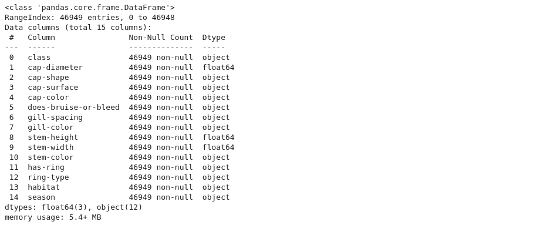
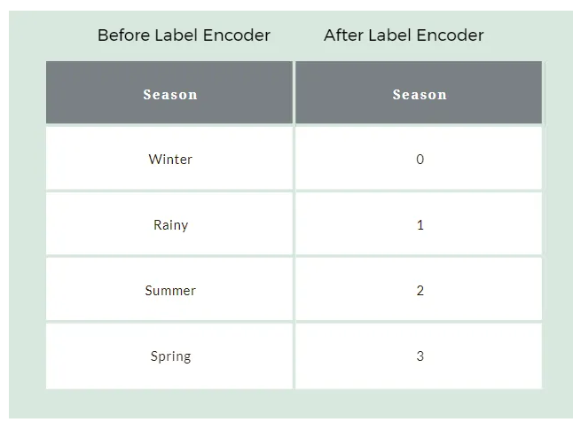
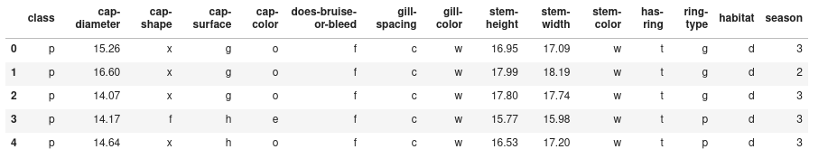
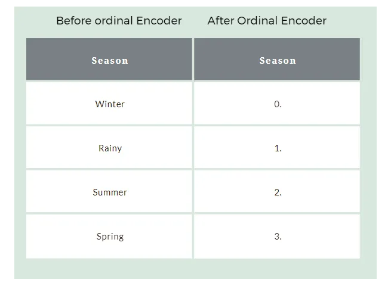
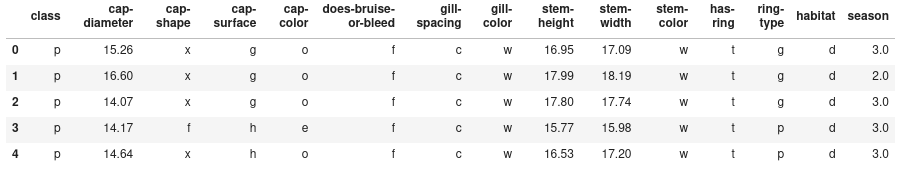
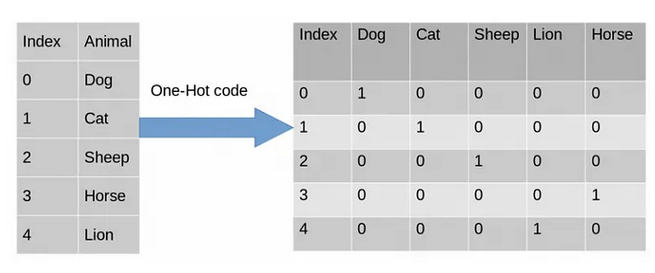
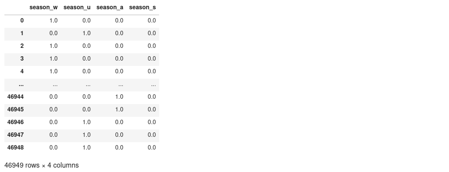

## Different methods to Encode

**Machine learning model** eventually tries to find out the pattern, equation from the data while training hence it only understands data in **numerical** format. It doesn't understand the textual format. Therefore we also need to convert all the text based column into numerical format but It doesn't mean that we'll assign any number to any label in a text column. We should convert text feature into numerical format in a very meaningful fashion. 

**Let's study the different methods to encode / convert the categorical columns -**

## Types of Categorical Data

Categorical data can be considered as the finite possible values that are divided into groups. For Example — different blood groups, Genders, Different cities, and states. There are two types of categorical data:

### Ordinal Data
Data that comprises a finite set of discrete values with an order or level of preferences. Example — [Low, Medium, High], [Positive, Negative], [True, False]

### Nominal Data
Data that comprises a finite set of discrete values with no relationship between them. Example — [“India”, “America”, “England”], [“Lion”, “Monkey”, “Zebra”]


**Note -** For Ordinal Data, after encoding the data and training the model, we need to transform it to its original form again, as it is needed to properly predict the value. But for Nominal Data, it is not required as here preference doesn’t matter, we just need the information.

Let's begin **encoding** the categorical variables by first knowing about the data

### About Data

New data, new data 😆. We are taking [mushroom dataset](https://github.com/muttinenisairohith/Datasets/raw/main/data/processed_mushroom_dataset.csv) which consists **cap shape**, **cap diameter**, **gill spacing** etc... properties of mushroom and target column **class** of mushroom. Let's load and view the info about it.

```python
df = pd.read_csv('https://raw.githubusercontent.com/muttinenisairohith/Datasets/main/data/processed_mushroom_dataset.csv')
df.info()
```

**Output**

As we can see we have 15 columns out of which 12 are of Datatype — object And there are no missing values in this data. So we need to Encode these 12 features before we go for modeling.



## Label Encoding

In Label Encoding, each label will be converted into an integer value. Here the output will be 1 dimensional.



Now we are using an awesome library named **scikit-learn**, we are using this library in further days alot in many projects. So install it using `pip install scikit-learn==<version-name>`

```python
from sklearn.preprocessing import LabelEncoder
le = LabelEncoder()
df["season"] = le.fit_transform(df["season"])
```

After using label encoder, **output** of season column is like



## Ordinal Encoding

Similar to label Encoding but ordinal Encoding is generally used when we are intended for input variables that are organized into rows and columns. (eg: Matix)



```python
from sklearn.preprocessing import OrdinalEncoder
oe = OrdinalEncoder()
encoded_df["season"] = oe.fit_transform(df[["season"]])
```

After using ordinal encoder, **output** of season column is like



## One Hot Encoding

In One-Hot Encoding, each category of any categorical variable gets a new variable. It maps each category with binary numbers (0 or 1). This type of encoding is used when the data is nominal. Newly created binary features can be considered dummy variables. After one hot encoding, the number of dummy variables depends on the number of categories presented in the data.



For One hot encoding, we will be using the category_encoders package instead of sklearn, as it is more useful.

To install **category_encoders**, use `pip install category_encoders`

```python
from category_encoders import OneHotEncoder
ohe = OneHotEncoder( handle_unknown='return_nan', return_df=True, use_cat_names=True)
ohe_results = ohe.fit_transform(df[["season"]])
```
After using category encoders, **output** of season column is like



## Conclusion

There are also other Encoding libraries that can be used for encoding and internal functions in pandas such as map, replace, apply can also be used for encoding, But the methods provided above are easy ways to encode the data and inverse transform it in time. So I have skipped those methods.

