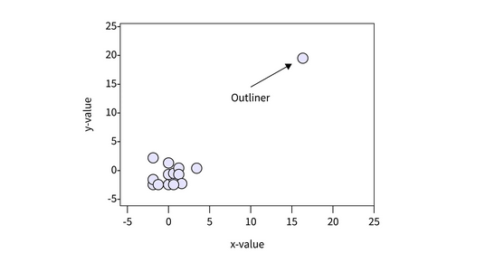
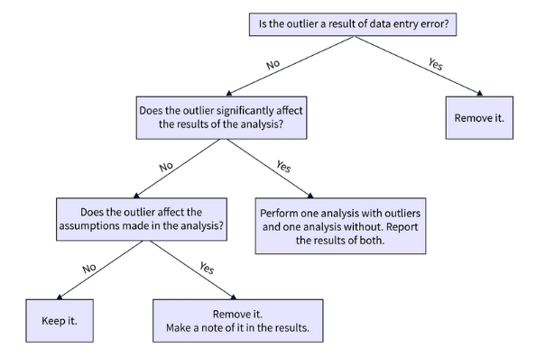
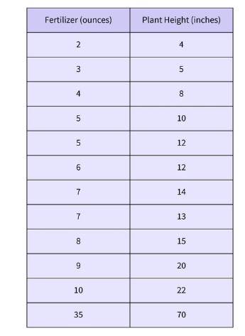
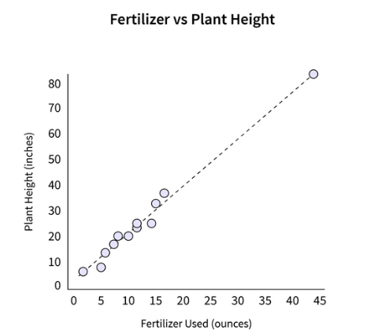
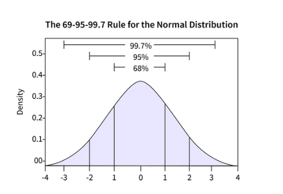
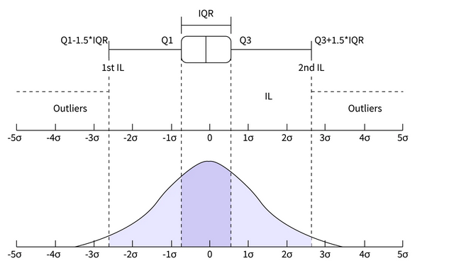

## Different methods to remove outliers 🏮

## What are Outliers ? ⛩️

An **outlier** is an extreme value that lies at an abnormal distance from other points in the dataset. Dealing with outliers is tricky because sometimes, it can reveal abnormal cases or individuals with rare traits. It can also distort statistical analyses and violate their assumptions. In general, machine learning modeling and model skills can be improved by understanding and even removing these outlier values. Hence it is sometimes recommended to remove outliers from data before feeding it to the machine learning model. 

As mentioned earlier, outliers are extreme values present in data. One can look into small data and decide whether it is an outlier. Consider an array=`[12,5, 9, 11, 72, 7, 61]`. In this data, `72` and `61` can be considered an outlier.



Most of the time, data scientists deal with larger-size data. Hence, identifying outliers from data looking at a glance is not possible. Instead, there are different methods to identify and decide whether the data point is an outlier. Sometimes, a sample that lies beyond **three standard deviations** of the data is considered an outlier. **InterQuartile Range (IQR)** is also used to identify possible outliers. IQR is used to measure variability by dividing a data set into quartiles. The data is sorted in ascending order and split into three equal parts. Q1, Q2, and Q3, the first, second, and third quartiles, are the values that separate the four equal parts. Q1, Q2, and Q3 represent the data's 25th percentile, 50th percentile, and 75th percentile, respectively. **IQR is the range between the first and the third quartiles, namely Q1 and Q3: IQR = Q3 – Q1. The data points that fall below Q1 – 1.5 IQR or above Q3 + 1.5 IQR are outliers**.

## When should you remove outliers ? 🎨

Outliers sometimes affect the performance of a model, But they also uncover rare traits. Hence, whether to keep an outlier or not, that decision should be made judiciously. Look at the figure shown below:



Let's look at the image above. First, checking if the error is due to data entry is recommended. Suppose we observe the weight of a student is entered as 350kg in a survey. We can delete the entry as it is due to a manual error. Next, if the outlier is not because of manual error, we need to check its impact on the statistical analysis. Look at the table shown below:



Here, the last entry seems like an outlier. So here, we perform two regression plots, one without the outlier and one without the outlier.

Undoubtedly, the outlier changes the slope of the regression line significantly. Hence, we can safely discard it.



If the analysis shows that the outlier doesn't impact the result, one needs to check if it contradicts the assumptions made in the analysis. If yes, then again, we can discard the outlier, or there is no harm in keeping the outlier and feeding the data to the model.

## Methods to Remove outliers (code example) 💳

Several methods can help us to detect the outlier. Once detected, we can quickly eliminate them from our data before feeding the data into a model. Here, we will discuss three different methods to identify and remove outliers.

### Standard Deviation Method 🌌

If data follows gaussian or nearby gaussian distribution, the standard deviation can be used as a cut-off for identifying outliers. For data following gaussian distribution, its mean summarises the percentage of values in the sample. For example, 1 Standard Deviation from the mean covers 68% of data, 2 Standard Deviations from the mean cover 95% of data, and 3 Standard Deviations from the mean cover 99.7%.



Generally, samples that are three standard deviations from the mean can be considered outliers. Occasionally, the data is standardized first using a Z-score. Next, outlier detection can be completed using Z-score cut-off values. A python code is shown below:

```python

# identify outliers with standard deviation
from numpy.random import seed
from numpy.random import randn
from numpy import mean
from numpy import std
# seed the random number generator
seed(1)
# generate univariate observations
data = 5 * randn(10000) + 50
# calculate summary statistics
data_mean, data_std = mean(data), std(data)
# identify outliers
cut_off = data_std * 3
lower, upper = data_mean - cut_off, data_mean + cut_off
# identify outliers
outliers = [x for x in data if x < lower or x > upper]
print('Identified outliers: %d' % len(outliers))
# remove outliers
outliers_removed = [x for x in data if x >= lower and x <= upper]
print('Non-outlier observations: %d' % len(outliers_removed))
```

**Output**

```python
Identified outliers: 29
Non-outlier observations: 9971
```

### Interquartile Range 🐬

Training data may only sometimes follow Gaussian distribution or nearly Gaussian distribution. In such cases, the Interquartile Range, or IQR for short, helps to eliminate outliers. The IQR is the difference between the data's 75th and 25th percentiles. It represents the box in a box and whisker plot. IQR-based outlier detection techniques assume that the non-anomalous data points lie at high-density regions, while outliers would occur sparsely.



```python
# identify outliers with interquartile range
from numpy.random import seed
from numpy.random import randn
from numpy import percentile
# seed the random number generator
seed(1)
# generate univariate observations
data = 5 * randn(10000) + 50
# calculate interquartile range
q25, q75 = percentile(data, 25), percentile(data, 75)
iqr = q75 - q25
print('Percentiles: 25th=%.3f, 75th=%.3f, IQR=%.3f' % (q25, q75, iqr))
# calculate the outlier cutoff
cut_off = iqr * 1.5
lower, upper = q25 - cut_off, q75 + cut_off
# identify outliers
outliers = [x for x in data if x < lower or x > upper]
print('Identified outliers: %d' % len(outliers))
# remove outliers
outliers_removed = [x for x in data if x >= lower and x <= upper]
print('Non-outlier observations: %d' % len(outliers_removed))
```

**Output**

```python
Percentiles: 25th=46.685, 75th=53.359, IQR=6.674
Identified outliers: 81
Non-outlier observations: 9919
```

### Automatic Outlier Detection : One class classification 🦈

One-class classification is another approach for identifying outliers. A one-class classifier is trained on data without an outlier. Once training is done, it can identify data comprised of both outliers. The local outlier factor(LOF) algorithm works based on the nearest neighbors technique for outlier detection. Here, samples are given a score based on how isolated they are based on their local neighborhood. Examples with the most significant score are more likely to be outliers.

```python
# evaluate the model on the training dataset with outliers removed
from pandas import read_csv
from sklearn.model_selection import train_test_split
from sklearn.linear_model import LinearRegression
from sklearn.neighbors import LocalOutlierFactor
from sklearn.metrics import mean_absolute_error
# load the dataset
url = 'https://raw.githubusercontent.com/jbrownlee/Datasets/master/housing.csv'
df = read_csv(url, header=None)
# retrieve the array
data = df.values
# split into input and output elements
X, y = data[:, :-1], data[:, -1]
# split into train and test sets
X_train, X_test, y_train, y_test = train_test_split(X, y, test_size=0.33, random_state=1)
# summarize the shape of the training dataset
print(X_train.shape, y_train.shape)
# identify outliers in the training dataset
lof = LocalOutlierFactor()
yhat = lof.fit_predict(X_train)
# select all rows that are not outliers
mask = yhat != -1
X_train, y_train = X_train[mask, :], y_train[mask]
# summarize the shape of the updated training dataset
print(X_train.shape, y_train.shape)
# fit the model
model = LinearRegression()
model.fit(X_train, y_train)
# evaluate the model
yhat = model.predict(X_test)
# evaluate predictions
mae = mean_absolute_error(y_test, yhat)
print('MAE: %.3f' % mae)
```

**Output**

```python
(339, 13) (339,)
(305, 13) (305,)
MAE: 3.356
```
