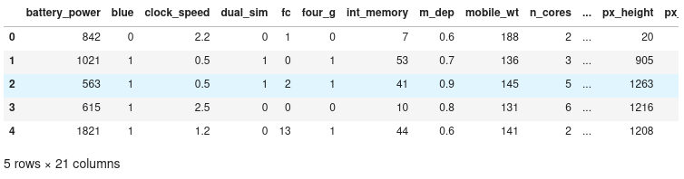
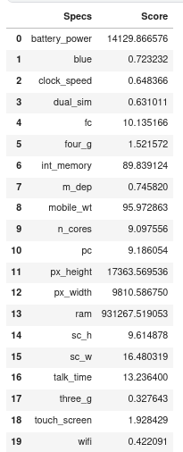
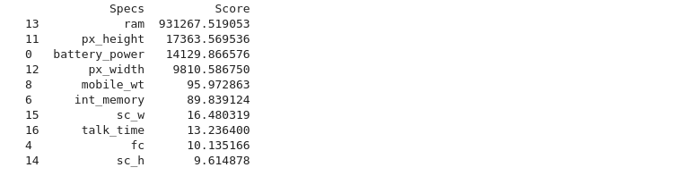
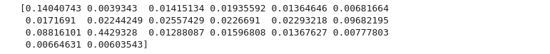
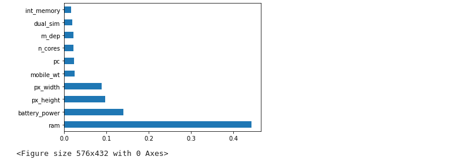
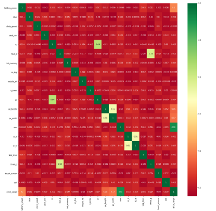

## Different methods for Feature Selection 📱

We all may have faced the problem of identifying the important features from a set of given data and removing the irrelevant or less important features which do not contribute much to our decision making in order to achieve better accuracy for our model.

In machine learning and statistics, feature selection, also known as variable selection, attribute selection or variable subset selection, is the process of reducing the number of input variables when developing a predictive model. Feature selection techniques are used for several reasons:

- It reduces model complexity by dropping some irrelevant features.
- Helps ML algorithm to train a model faster.
- Reduction of dimensionality helps in avoid overfitting.

## Techniques 🥋🥋

In this , we'll discuss 3 essential techniques :

- **Univariate Selection**
- **Feature Importance**
- **Correlation matrix with heatmap**

Before Discussing above three techniques let us go through the basic methodologies used for feature selection.

- **Filter Method:**

Filter feature selection methods use statistical techniques to evaluate the relationship between each input variable and the target variable, and these scores are used as the basis to choose (filter) those input variables that will be used in the model.

The statistical measures used in filter-based feature selection are generally calculated one input variable at a time with the target variable. As such, they are referred to as univariate statistical measures. This may mean that any interaction between input variables is not considered in the filtering process.

**Note:**- In this case, the existence of correlated predictors makes it possible to select important, but redundant, predictors. The obvious consequences of this issue are that too many predictors are chosen and, as a result, collinearity problems arise. 


- **Wrapper Method:**

Wrapper feature selection methods create many models with different subsets of input features and select those features that result in the best performing model according to a performance metric. These methods are unconcerned with the variable types, although they can be computationally expensive. Recursive Feature Elimination (RFE) is a good example of a wrapper feature selection method.


> **Forward Selection**: Forward selection is an iterative method in which we start with having no feature in the model. In each iteration, we keep adding the feature which best improves our model till an addition of a new variable does not improve the performance of the model.


> **Backward Elimination**: In backward elimination, we start with all the features and removes the least significant feature at each iteration which improves the performance of the model. We repeat this until no improvement is observed on removal of features.


> **Recursive Feature elimination**: It is a greedy optimization algorithm which aims to find the best performing feature subset. It repeatedly creates models and keeps aside the best or the worst performing feature at each iteration. It constructs the next model with the left features until all the features are exhausted. It then ranks the features based on the order of their elimination.

## Begin with Data 🏁

So, now we are looking the **mobile price data** which helps the machine learning model to classify the range of price of mobile. You can view the data [here](https://www.kaggle.com/datasets/iabhishekofficial/mobile-price-classification).


## Univariate Method 🏇

* Statistical tests can be used to select those features that have the strongest relationship with the output variable.

* The scikit-learn library provides the SelectKBest class that can be used with a suite of different statistical tests to select a specific number of features.

* The example below uses the chi-squared (chi²) statistical test for non-negative features to select k (k=10) of the best features from the Mobile Price Range Prediction Dataset.

### View the feature and target 👁️‍🗨️

```python
import pandas as pd
import numpy as np
from sklearn.feature_selection import SelectKBest
from sklearn.feature_selection import chi2

mobile_data = pd.read_csv("../input/mobile-price-classification/train.csv")

X = mobile_data.iloc[:,0:20]  #independent variables
y = mobile_data.iloc[:,-1]    #target variable i.e price range
mobile_data.head()
```

**Output**



### Fit the chi^2 method 🟪

```python
#apply SelectKBest class to extract top 10 best features

BestFeatures = SelectKBest(score_func=chi2, k=10)
fit = BestFeatures.fit(X,y)
```

### View the scores for each feature 💯

```python
df_scores = pd.DataFrame(fit.scores_) ## scores on each feature
df_columns = pd.DataFrame(X.columns) # columns corresponding to score

# now merge columns and their scores
f_Scores = pd.concat([df_columns,df_scores],axis=1) 
f_Scores.columns = ['Specs','Score']
f_Scores
```



**To view 10 most essential features**

```python
print(f_Scores.nlargest(10,'Score'))
```


**Note:** Using Above score we can conclude that 'ram' is the most important feature among all the features which is also true in practical scenario.

## Feature Importance 🔏


- You can get the feature importance of each feature of your dataset by using the feature importance property of the model.

- Feature importance gives you a score for each feature of your data, the higher the score more important or relevant is the feature towards your output variable.

- Feature importance is an inbuilt class that comes with Tree Based Classifiers, but here in this example I will be using XGB Classifier for extracting the top 10 features for the dataset.

```python
import xgboost
import matplotlib.pyplot as plt

model = xgboost.XGBClassifier()
model.fit(X,y)
print(model.feature_importances_) 
```

**Output**



### plot the graph of feature importances for better visualization  💹

```python
feat_imp = pd.Series(model.feature_importances_, index=X.columns)
feat_imp.nlargest(10).plot(kind='barh')

plt.figure(figsize=(8,6))
plt.show()
```

**Output**



## Correlation Matrix 🕯️🕯️

- Correlation states how the features are related to each other or the target variable.

- Correlation can be positive (increase in one value of feature increases the value of the target variable) or negative (increase in one value of feature decreases the value of the target variable)

- Heatmap makes it easy to identify which features are most related to the target variable, we will plot heatmap of correlated features using the seaborn library.

```python
import seaborn as sns

#get correlations of each features in dataset
corrmat = mobile_data.corr()
top_corr_features = corrmat.index

plt.figure(figsize=(20,20))

#plot heat map
g=sns.heatmap(mobile_data[top_corr_features].corr(),annot=True,cmap="RdYlGn")
```

**Output**



**Note**: From above correlation plot we can conclude that the feature 'price_range' and 'ram' are highly correlated features which can also be related with the present situation. As ram of your mobile increases price also gets increases. 


