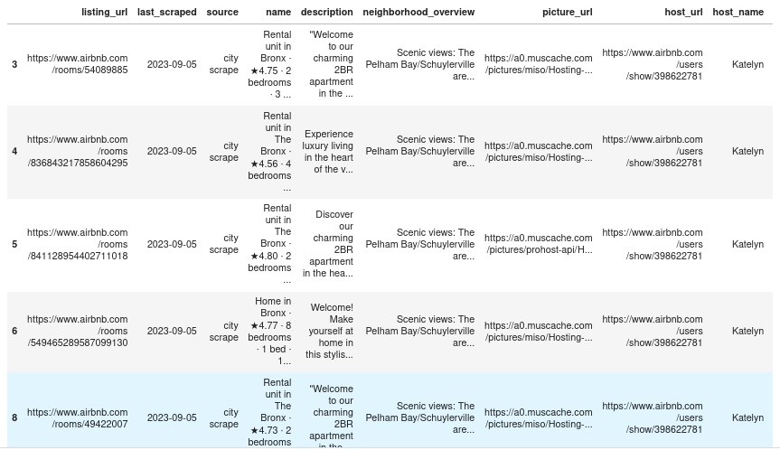
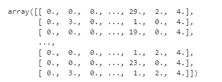
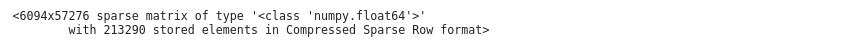

## Build Data Preprocessing Pipeline

Today we will going to learn -

- Reproduce transformations easily on any dataset.
- Easily track all transformations you apply to your dataset.
- Start building your library of transformations which you can use later

## Begin with Data

For all of these examples, I will be using the airbnb NYC listings dataset from [insideairbnb](http://insideairbnb.com/) . This is a real dataset containing information scraped from airbnb and has all the information related to a listing on the site.

Let us imagine we want to predict the price of a listing given some variables like the property type and neighborhood.

```python
raw_data = pd.read_csv('http://data.insideairbnb.com/united-states/ny/new-york-city/2023-09-05/data/listings.csv.gz',compression='gzip')

# View the data
raw_data.head() # data can't be showed fully, so run by yourself on your notebook 
```


Let’s start by getting our categorical and numerical variables that we want to work with. We will keep it simple by removing data with missing values in our categorical variables of interest and with no reviews.

```python
#Categorical variables to use
cat_vars = ["instant_bookable", "is_business_travel_ready", "cancellation_policy","host_is_superhost", "neighbourhood_cleansed","property_type","room_type", "bed_type"]

# Numerical Variables to use
num_vars = ['price', 'square_feet','minimum_nights','weekly_price', 'monthly_price', 'security_deposit','bathrooms', 'bedrooms', 'beds', "guests_included",
       'cleaning_fee', "reviews_per_month","host_listings_count",
           "calculated_host_listings_count_shared_rooms", "host_response_rate", "host_acceptance_rate",
           "review_scores_cleanliness","review_scores_value","review_scores_rating", "number_of_reviews"]

airbnb_data = raw_data

# Drop observations if categorical data is missing
before = airbnb_data.shape[0]
airbnb_data = airbnb_data.dropna(subset=cat_vars + ["number_of_reviews"])
airbnb_data = airbnb_data[airbnb_data['number_of_reviews']>0]
after = airbnb_data.shape[0] # rows reduced as we are dropping the whole row if categorical data is missing


airbnb_data = airbnb_data[cat_vars + num_vars]
```

## Imputation

Is a dataset even real if it isn’t missing data? The reality is that we have to deal with missing data all the time. You will have to decide how to deal with missing data for your specific use

- You can dropna() rows with missing data. Might drop too much data.
- Drop the variable that has missing data. What if you really want that variable?
- Replace NAs with zero, the mean, median, or some other calculation.

Scikit-Learn provides us with a nice simple class to deal with missing values.

Let us impute numerical variables such as price or security deposit with the median. For simplicity, we do this for all numerical variables.

```python
from sklearn.impute import SimpleImputer
imputer = SimpleImputer(strategy="median")# Num_vars is the list of numerical variables 
airbnb_num = airbnb_data[num_vars]
airbnb_num = imputer.fit_transform(airbnb_num)
```

The `SimpleImputer` class will replace all the missing values with the median. The `.fit_transform()` method will return a nice numpy array object that is ready to be used with any machine learning method. You can choose different metrics and pass it as an argument.

## Encoding Categorical Variables

Numerical variables are pretty straightforward. Let us deal with categorical data that usually comes in strings. In this case, we have to deal with variables such as neighborhood, room_type, bed_type. Machine Learning algorithms work better with numbers, so we will convert our categorical variables.

How our categorical data looks:

```python
airbnb_data[cat_vars].head()
```

**Output**



We use the **OrdinalEncoder** to convert our string data to numbers. Each unique value in the variables will be mapped to a number. E.g Apartment =0, Condominium=1, etc.

```python
from  sklearn.preprocessing import OrdinalEncoder
airbnb_cat = airbnb_data[cat_vars]
ordinal_encoder = OrdinalEncoder()
airbnb_cat_encoded = ordinal_encoder.fit_transform(airbnb_cat)
airbnb_cat_encoded[:,1:10]
```

After encoding we get,



Are we done? Not yet. ML algos can take things a little to literally and think that categories 1 and 2 are more similar than 1 and 19. This might be good for ratings or things where there is an order but how about neighborhoods? Can this simple encoder differentiate the vibes of SoHo and TriBeCa? Does it know all the normies work in Midtown?

We can transform our data to have a singular attribute per category. For Example, we create an attribute equal to 1 when the ‘property_type’ is ‘House’ and 0 otherwise. Repeat for all other categories.

This process is called one-hot encoding. If you come from a stats or econometrics background these are called dummy variables/attributes.

```python

```

We'll get the **output** like below,



A wild sparse matrix appears! Instead of a NumPy array the encoder returns a sparse matrix which is very convenient when we have several categorical attributes with hundreds of categories.

The matrix is full of 0s except for a single 1 per row. This would use a lot of memory to store but the spare matrix is smart and stores only the location of the nonzero elements.

## Feature Scaling

It is very important to scale our data when using machine learning algorithms. There are exceptions, but when the variables are in different scales we usually need to scale them. You can read all about it here.

A couple of ways to do it:

- **Min-max scaling**: substract the min value and divide by the range (max-min). Values will range from 0 to 1. The MinMaxScaler does this.
- **Standardization**: substract mean and divide by standard deviation. You end up with 0 mean and unit variance. Values are not bounded in this case. Standardization is less affected by outliers. We can use StandardScaler.

```python
from sklearn.preprocessing import StandardScaler
StandardScaler().fit_transform(airbnb_num)
```

That was easy!

## Custom Transformations

Scikit-Learn API is very flexible lets you create your own custom “transformation” that you can easily incorporate into your process. You just need to implement the **fit()**, **transform()**, and **fit_transform()** methods.

Adding the `TransformerMixin` as a base class gets you the **fit_transform()** method automatically.

Here we have a very simple transformer that creates the ratio of rating to number of reviews. You can make these as complicated as you wish.

```python
from sklearn.base import BaseEstimator, TransformerMixin

ratings_index = -2
reviews_index = -1
class NewVariablesAdder(BaseEstimator, TransformerMixin):
    
    def __init__(self):
        pass
    
    def fit(self, X, y=None):
        return self
    
    def transform(self, X):
    # Make a new variable that is rating divided by number of reviews
        ratings_over_reviews = X[:,ratings_index]/X[:,reviews_index]
        return np.c_[X, ratings_over_reviews]
```

Checkout the Scikit-Learn documentation for more details and [examples](https://scikit-learn.org/stable/developers/develop.html).

## Build sequential pipeline

We can finally put everything together! One dataset can require several transformations which vary according to the variable type. These must also be performed in the right order.

Scikit-Learn gifts us the Pipeline class to help with this ubiquitous process to write clean and efficient code.

```python
from sklearn.pipeline import Pipeline

num_pipeline = Pipeline([
    ('imputer', SimpleImputer(strategy='median')),
    ('add_variables', NewVariablesAdder()),
    ('std_scaler', StandardScaler())
])

num_transformed = num_pipeline.fit_transform(airbnb_num)
```

We created a pipeline for our numerical variables. The Pipeline constructor takes in a list of (‘Estimator Name’, Estimator()) pairs. All estimators except the last one must have the fit_transform() method. They must be transformers. The names should be informative but you can put whatever you want.

Let us complete our pipeline with our categorical data and create our “master” Pipeline

```python
from sklearn.compose import ColumnTransformer

data_pipeline = ColumnTransformer([
    ('numerical', num_pipeline, num_vars),
    ('categorical', OneHotEncoder(), cat_vars),
    
])

airbnb_processed = data_pipeline.fit_transform(airbnb_data)
```

We can combine different pipelines applied to different sets of variables. Here we are applying our numerical pipeline (Impute, Transform, Scale) to the numerical variables (num_vars is a list of column names) and do hot encoding to our categorical variables (cat_vars is a list of column names).

The `ColumnTransformer` class will do exactly what the name implies. It will apply the pipeline or transformer to a specified list of variables.

It takes in a list of tuples with (‘name’, transformer/pipeline, ‘variables list’)

Once we have set up and defined our pipeline process, we can apply it to any dataset or fresh new data easily with the `fit_transform()` method.

## Conclusion

Now you know the basics of implementing clean and efficient pipelines that can be easily organized and utilized on different datasets. For more detailed information reference the Scikit-Learn documentation

Why stop at pre-processing? In the pipeline you can finish with the training of your model. Here is a quick complete example:

```python
from sklearn.svm import SVC
from sklearn.preprocessing import StandardScaler
from sklearn.datasets import make_classification
from sklearn.model_selection import train_test_split
from sklearn.pipeline import Pipeline

X, y = make_classification(random_state=0)
 X_train, X_test, y_train, y_test = train_test_split(X, y, random_state=0)
pipe = Pipeline([('scaler', StandardScaler()), ('svc', SVC())])

# The pipeline can be used as any other estimator
# and avoids leaking the test set into the train set
pipe.fit(X_train, y_train)
Pipeline(steps=[('scaler', StandardScaler()), ('svc', SVC())])
pipe.score(X_test, y_test)
#0.88
```
Once you have your data transformation setup, you can include the training as another “estimator” in your pipeline. Your pipeline can be used as any other estimator. SVC() is included at the end and will use the scaled data passed to it. You can then reuse this pipeline for many other machine learning algorithms or datasets.

